# Decisions

The desk of decisions. Every frame the user sees is `decisions-render.sh`
stdout, relayed exactly as printed - never re-typed, re-flowed, or
summarised, and never hand-padded. A decision is presented as a card: the
exact record it would become, framed. Nothing here writes a record file
directly - every write is `decisions-capture.sh` or `decisions-transition.sh`.

This shell owns only routing.

## Flow

```dot
digraph decisions {
    "Draw the Shelf (list | render shelf)" [shape=box];
    "Selection in words -> list filters" [shape=box];
    "Draw the archive under the Shelf" [shape=box];
    "Draw the question card" [shape=box];
    "Draw the decision card" [shape=box];
    "Draw the reopen card (diff against the file)" [shape=box];
    "Draw the retire card (claimed by / shipped by)" [shape=box];
    "User's move?" [shape=diamond];
    "Card came from the root and changed?" [shape=diamond];
    "Filed pending in the root" [shape=doublecircle];
    "Filed as law in approved/" [shape=doublecircle];
    "Filed declined in archive/" [shape=doublecircle];
    "Rewritten in place" [shape=doublecircle];
    "Retired to archive/" [shape=doublecircle];
    "Refused: crafted law is frozen" [shape=box];

    "Draw the Shelf (list | render shelf)" -> "Selection in words -> list filters";
    "Selection in words -> list filters" -> "Draw the archive under the Shelf" [label="'declined', 'retired'"];
    "Selection in words -> list filters" -> "Draw the question card" [label="pending, lettered options"];
    "Selection in words -> list filters" -> "Draw the decision card" [label="pending, dashed options"];
    "Selection in words -> list filters" -> "Draw the reopen card (diff against the file)" [label="law + words that change its text"];
    "Selection in words -> list filters" -> "Draw the retire card (claimed by / shipped by)" [label="'retire ...'"];

    "A ruling in conversation" -> "Draw the question card" [label="live fork"];
    "A ruling in conversation" -> "Draw the decision card" [label="no fork"];

    "Draw the question card" -> "User's move?";
    "Draw the decision card" -> "User's move?";
    "Draw the reopen card (diff against the file)" -> "User's move?";
    "Draw the retire card (claimed by / shipped by)" -> "User's move?";

    "User's move?" -> "Draw the question card" [label="words on a question card: redraw"];
    "User's move?" -> "Draw the decision card" [label="a letter picks an option: redraw as decision"];
    "User's move?" -> "Draw the decision card" [label="words on a decision card: redraw"];
    "User's move?" -> "Draw the reopen card (diff against the file)" [label="words on a reopen card: redraw the diff"];
    "User's move?" -> "Card came from the root and changed?" [label="approve / keep pending / decline (letter or plain words)"];
    "User's move?" -> "Rewritten in place" [label="a) on a reopen card: capture --reopen --quote"];
    "User's move?" -> "Refused: crafted law is frozen" [label="a) on a reopen card, record is crafted"];
    "User's move?" -> "Draw the retire card (claimed by / shipped by)" [label="words say retire"];
    "User's move?" -> "Draw the retire card (claimed by / shipped by)" [label="words on a retire card: redraw (nothing to reshape)"];
    "User's move?" -> "Draw the reopen card (diff against the file)" [label="words on a retire card that change the text: draw the reopen card"];
    "User's move?" -> "Retired to archive/" [label="a) on a retire card: transition deprecate --quote, then offer slug removal to planning/ready claimants"];
    "Selection in words -> list filters" -> "Refused: crafted law is frozen" [label="'retire ...' on crafted law: no card, the ruled words"];
    "Refused: crafted law is frozen" -> "Draw the decision card" [label="offer a fresh card"];

    "Card came from the root and changed?" -> "Filed as law in approved/" [label="fresh, approve: capture --quote"];
    "Card came from the root and changed?" -> "Filed pending in the root" [label="fresh, keep pending: capture"];
    "Card came from the root and changed?" -> "Filed declined in archive/" [label="fresh, decline: capture, transition decline --quote"];
    "Card came from the root and changed?" -> "Filed as law in approved/" [label="parked, changed, approve: capture --reopen (root), transition accept --quote"];
    "Card came from the root and changed?" -> "Filed as law in approved/" [label="parked, unchanged, approve: transition accept --quote"];
    "Card came from the root and changed?" -> "Filed pending in the root" [label="parked, changed, keep pending: capture --reopen (root)"];
    "Card came from the root and changed?" -> "Filed pending in the root" [label="parked, unchanged, keep pending: nothing, say so"];
    "Card came from the root and changed?" -> "Filed declined in archive/" [label="parked, decline: transition decline --quote"];
}
```

Boxes are things this shell draws, diamonds are the two questions it ever
asks itself, double circles are the writes. Every box runs
`decisions-render.sh` and relays its stdout untouched - never re-typed,
re-flowed, or summarised. "Changed" means the card as last drawn differs
from the file it came from.

## Selection

Bare invocation is one unfiltered `decisions-list.sh` call piped into
`decisions-render.sh shelf`. Nothing renders below the Shelf unless asked.

Selection is conversational and maps to `decisions-list.sh`'s own filters -
`--tag=` `--status=` `--slug=` `--room=` `--disposition=` - never subcommand
syntax.

The archive is reached only in words, printed under the Shelf: "what did we
decline" maps to `decisions-list.sh --room=archive` piped into
`decisions-render.sh archive --only=declined`; "what did we retire" to
`--only=retired`; "show the archive" or "what's in the archive" prints both.

## The card

- One ruling per card - a card carrying several decisions is split into two cards; Context is verified against disk at presentation time.
- The answer is typed into the prompt - AskUserQuestion is never used anywhere in this flow. A typed letter is always a move, never a reference to `(a)`/`(b)`/`(c)` text sitting inside a record's own Options section.
- Any other words are the user's words: they redraw the whole card and file nothing - except on a reopen card, where they redraw the diff instead.
- A sentence that plainly names exactly one writing move (approve, keep pending, decline, retire) performs it, after any pick or reshape it carries; a sentence naming two writing moves, or naming one ambiguously, redraws the card and asks - it does not guess.
- A fresh card with a live fork draws first in the question state and redraws in the decision state once a letter lands; a card with no real alternatives draws straight in the decision state. The question card's own keep-pending letter is `decisions-capture.sh` with no quote - the same call the decision card's b) makes.
- A pending record picked from the Shelf draws `--variant=pending`; options lettered `(a)`, `(b)`, `(c)` with one `Proposed:` draws the question state, `- ` dashes draws the decision state - the file's own shape tells the two apart, and picking a letter re-authors the Options as dashes and the Decision as the pick.
- Sections handed to `decisions-capture.sh` are authored wrapped at 55 columns, one paragraph per idea, so the card's reflow reproduces the file's own line breaks. A card with one option or none has no fork and is authored dashed from the start.
- Consequences are always the chosen option's; once the options are dashes, they name the other options by what they are, never by letter.
- The Decision section opens with the ruling in the human's terms and nothing they did not agree to, optionally followed, inside the same section, by the fixed label `Ideas to consider, not ruled:` with two to four lines of the writer's own specifics, taken from the first draft and never invented for the block - that block is not law.
- Every decision carries exactly one tag; a second tag is offered only when an existing record can be named as the reason. A tag no record carries is announced NEW GROUP - checked with `decisions-list.sh --tag=<tag> --no-scan` and passed as `--new-group=` to the card when the answer is empty - and the user can rename it in words like anything else on the card.
- The Context carries an exhibit only when one actually makes sense; an exhibit is never invented to fill the section. `--quote=` carries the user's literal typed answer, a bare letter included.
- Before a reopen or a retire card, call `decisions-list.sh --slug=<slug>` with the story scan on and pass `--claimed-by=<story>:<status>` from each claiming story's own `status:` (or `--shipped-by=<story>` for crafted law); capture still writes first and prints `Claimed: <story>` lines, which this command relays after the write.
- Crafted law refuses retire before any card is drawn, in these words or as close as the record allows: "That one's already built. <story> shipped it, so the record is the history of why the code looks the way it does, and history stays. If the product should stop doing this, that's a new decision, and I'm happy to draw it up. Want the card?" - accepting offers a fresh decision card, the same as a crafted reopen.
- After `a) retire` moves claimed law to the archive, any claiming story whose status is `planning` or `ready` gets an offer to remove the slug from its own `decisions:` list - an inline edit of that one frontmatter line, made by this command itself, scoped to the slug and touching nothing else. A claimant whose status is `active` is told to read it again against the new meaning, and keeps its slug.
- "Changed" on a parked card means the card as last drawn differs from the file it came from; `b) keep pending` on an unchanged parked card writes nothing and says so.

## Receipts

Every write ends with one line: `Approved:`, `Kept pending:`, `Declined:`
or `Retired:` followed by the path the script printed as its last stdout
line. A no-op keep-pending prints `Nothing to save - still on the Shelf.`
instead.

## Not this file's job

No graduation flow ships here. No story template is edited, and nothing is
ever written onto a record itself beyond its own room, status and approval
line.
