# Decisions

The desk of decisions. Claude draws every frame from `decisions-view.sh`'s
data, following the `### The drawing rule` section below - a left rail
with horizontal rules, no right edge, no fixed width, quoted words
verbatim. A decision is
presented as a card: the exact record it would become. Nothing here writes
a record file directly - every write is `decisions-capture.sh` or
`decisions-transition.sh`.

This shell owns only routing.

## Flow

```dot
digraph decisions {
    "Draw the Shelf (list | view shelf)" [shape=box];
    "Selection in words -> list filters" [shape=box];
    "Draw the archive under the Shelf" [shape=box];
    "Draw the question card" [shape=box];
    "Draw the decision card" [shape=box];
    "Draw the reopen card (diff against the file)" [shape=box];
    "Draw the retire card (claimed by / shipped by)" [shape=box];
    "Draw the match drawer (decisions-view.sh match)" [shape=box];
    "No match: answer in words" [shape=box];
    "User's move?" [shape=diamond];
    "Card came from the root and changed?" [shape=diamond];
    "Filed pending in the root" [shape=doublecircle];
    "Filed as law in approved/" [shape=doublecircle];
    "Filed declined in archive/" [shape=doublecircle];
    "Rewritten in place" [shape=doublecircle];
    "Retagged in place" [shape=doublecircle];
    "Retired to archive/" [shape=doublecircle];
    "Refused: crafted law is frozen" [shape=box];

    "Draw the Shelf (list | view shelf)" -> "Selection in words -> list filters";
    "Selection in words -> list filters" -> "Draw the archive under the Shelf" [label="'declined', 'retired'"];
    "Selection in words -> list filters" -> "Draw the question card" [label="pending, lettered options"];
    "Selection in words -> list filters" -> "Draw the decision card" [label="pending, dashed options"];
    "Selection in words -> list filters" -> "Draw the reopen card (diff against the file)" [label="law + words that change its text"];
    "Selection in words -> list filters" -> "Draw the retire card (claimed by / shipped by)" [label="'retire ...'"];
    "Selection in words -> list filters" -> "Retagged in place" [label="words naming record(s) and a tag: transition retag --tag="];
    "Selection in words -> list filters" -> "Draw the match drawer (decisions-view.sh match)" [label="several blocks matched"];
    "Draw the match drawer (decisions-view.sh match)" -> "Selection in words -> list filters" [label="user names one: resolves as a single match"];
    "Selection in words -> list filters" -> "No match: answer in words" [label="zero blocks matched"];
    "No match: answer in words" -> "Draw the decision card" [label="offer a fresh card, new group"];

    "A ruling in conversation" -> "Draw the question card" [label="live fork"];
    "A ruling in conversation" -> "Draw the decision card" [label="no fork"];

    "Draw the question card" -> "User's move?";
    "Draw the decision card" -> "User's move?";
    "Draw the reopen card (diff against the file)" -> "User's move?";
    "Draw the retire card (claimed by / shipped by)" -> "User's move?";

    "User's move?" -> "Draw the question card" [label="words on a question card: redraw"];
    "User's move?" -> "Draw the decision card" [label="a letter picks an option: redraw as decision"];
    "User's move?" -> "Draw the decision card" [label="words on a decision card: redraw"];
    "User's move?" -> "Draw the reopen card (diff against the file)" [label="words on a reopen card: redraw the diff"];
    "User's move?" -> "Card came from the root and changed?" [label="approve / keep pending / decline (letter or plain words)"];
    "User's move?" -> "Rewritten in place" [label="a) on a reopen card: capture --reopen --quote"];
    "User's move?" -> "Refused: crafted law is frozen" [label="a) on a reopen card, record is crafted"];
    "User's move?" -> "Draw the retire card (claimed by / shipped by)" [label="words say retire"];
    "User's move?" -> "Draw the retire card (claimed by / shipped by)" [label="words on a retire card: redraw (nothing to reshape)"];
    "User's move?" -> "Draw the reopen card (diff against the file)" [label="words on a retire card that change the text: draw the reopen card"];
    "User's move?" -> "Retired to archive/" [label="a) on a retire card: transition deprecate --quote, then remove the slug from planning/ready claimants and say so"];
    "Selection in words -> list filters" -> "Refused: crafted law is frozen" [label="'retire ...' on crafted law: no card, the ruled words"];
    "Refused: crafted law is frozen" -> "Draw the decision card" [label="offer a fresh card"];

    "Card came from the root and changed?" -> "Filed as law in approved/" [label="fresh, approve: capture --quote"];
    "Card came from the root and changed?" -> "Filed pending in the root" [label="fresh, keep pending: capture"];
    "Card came from the root and changed?" -> "Filed declined in archive/" [label="fresh, decline: capture, transition decline --quote"];
    "Card came from the root and changed?" -> "Filed as law in approved/" [label="parked, changed, approve: capture --reopen (root), transition accept --quote"];
    "Card came from the root and changed?" -> "Filed as law in approved/" [label="parked, unchanged, approve: transition accept --quote"];
    "Card came from the root and changed?" -> "Filed pending in the root" [label="parked, changed, keep pending: capture --reopen (root)"];
    "Card came from the root and changed?" -> "Filed pending in the root" [label="parked, unchanged, keep pending: nothing, say so"];
    "Card came from the root and changed?" -> "Filed declined in archive/" [label="parked, decline: transition decline --quote"];
}
```

Boxes are things this shell draws, diamonds are the two questions it ever
asks itself, double circles are the writes. The Shelf, archive and
retag-receipt boxes are drawn by Claude from `decisions-view.sh`'s data,
following the `### The drawing rule` section below. The question, decision,
reopen and retire card boxes all draw the same way, from `decisions-view.sh
card`'s data. The reopen card's diff rows carry a `MARK=` key the drawing
rule below colours; `decisions-view.sh` itself emits no colour.
"Changed" means the card as last drawn differs from the file it came from.

### The drawing rule

- **Rail:** every line inside a frame begins with `│` (U+2502). Content
  follows after two spaces (`│  `).
- **Header band:** `┌─ ` + TITLE + ` ` + `─` repeated to roughly 50
  columns. The Shelf's title is `DECISION SHELF`; the card's is its status
  word in caps, then ` · tags: <tag> · source: <source>`. Nothing is
  right-aligned; the trailing rule is decoration and its length is not an
  invariant.
- **Closing:** `└` + `─` repeated to match the header band's length,
  roughly.
- **Section and group dividers:** `├─ ` + NAME. For a Shelf group: `├─
  <tag> ── <glyph strip> <total>` - one space, `──`, one space, the strip,
  one space, the count. The strip is every glyph in ? ○ ● ✓ order, never
  truncated. For a card section: `├─ CONTEXT` etc., the label in caps,
  nothing after it.
- **Rows under a group:** four spaces after the rail, glyph, one space,
  date-stripped slug: `│    ○ slug`. The "+N more" row: six spaces after
  the rail: `│      +7 more`. Done records never get a row - they are
  counted in the strip and the total and draw no row of their own, so a
  group's total is expected to exceed its row count and that difference is
  never a defect to report.
- **Match drawer rows:** the header band reads `<N> MATCH "<words>"` - count,
  then the words verbatim, the quoted segment dropped when no words were
  given. The key band is the Shelf's own band plus `× archived`. Each record
  line is a `HEAD=` line at two spaces after the rail, not a `ROW=` line:
  glyph, two spaces, the title. There is no group divider, no strip and no
  count - these are not group rows.
- **Body under a card section:** four spaces after the rail, text wrapped
  at about 70 columns (a preference, not an invariant - a long word or
  path may exceed it). Bullet continuation lines indent two more. Approval
  quote lines print exactly as the file holds them, `> ` prefix included,
  never re-wrapped.
- **Reopen diff:** each diff row carries a `MARK=` key alongside its
  `ROW=`/`HEAD=` value - a removed row draws red, an added row draws
  green, an unmarked row draws plain. `decisions-view.sh` emits the marker
  only; colour is drawn here, never by the script.
- **Blank rail lines:** `│` alone (no trailing spaces) between groups,
  between card sections, after the header band's content, and before the
  closing line of YOUR MOVE.
- **Card identity:** the dated slug on the first line under the header
  band, a blank rail, the title, a blank rail, then the first section
  divider. Never on the header band.
- **YOUR MOVE:** letters and their effects as today, two-space-aligned as
  today, then a blank rail, then the closing line `a, b, c, or just tell
  me what to change.` (or the face's own closing line) at two spaces.
- **Receipt drawer:** the group's divider and its rows exactly as they
  would appear on the Shelf, no header band, no closing line.
- **Left-anchored fixed columns survive.** No fixed width means no line is
  padded to a frame edge. A column padded from the LEFT to line up its
  neighbours is fine: the retire face's claimants table keeps `<story>`
  padded to a fixed width with the status after it, the archive keeps its
  9-column exit-label field, and YOUR MOVE keeps its two-space-aligned
  effects.
- **No right edge. No padding to a right edge. No ellipsis. No
  box-drawing character in any script's stdout.** This file, by contrast,
  MUST show the rail characters - it is where Claude reads the shape from.

## Selection

Bare invocation is one unfiltered `decisions-list.sh` call piped into
`decisions-view.sh shelf`. Nothing renders below the Shelf unless asked.

Selection is conversational and maps to `decisions-list.sh`'s own filters -
`--tag=` `--status=` `--slug=` `--room=` `--disposition=` - never subcommand
syntax.

A selection headed for a card resolves to exactly one record before anything
draws: the desk reads the block count off the `decisions-list.sh` output it
already holds and routes on that count before drawing anything. One block
draws the card as today, unchanged. Several blocks draw
`decisions-view.sh match --words="<the words searched>"` over that same list
output, per the drawing rule above, and the desk asks; the answer names one
of the drawer's rows, which maps back to the `SLUG=` of the block that row
came from - the list output already in hand, never a fresh filter over the
words. Zero blocks are never piped into `decisions-view.sh shelf` - that view
is for a store with no records at all, not a selection that missed, so a
zero-block result is answered in words instead, no frame drawn: the desk
names the filter back, names the nearest group by spelling plus a count of
the remaining groups (never a full dump of every group), and offers a fresh
card tagged with it, announced as a NEW GROUP. This rule governs a selection
headed for a card only; the archive below and a retag's own resolution are
unaffected.

The archive is reached only in words, printed under the Shelf: "what did we
decline" maps to `decisions-list.sh --room=archive` piped into
`decisions-view.sh archive --only=declined`; "what did we retire" to
`--only=retired`; "show the archive" or "what's in the archive" prints both.

Words naming one or more records and a tag - "move decision-1 to
wright-journal", "put these two in wright-journal" - call
`decisions-transition.sh <slug>[,<slug>...] retag --tag=<target>`: no card is
drawn, no quote is taken, and no approval line is written. Naming a source
group instead of specific records resolves through
`decisions-list.sh --tag=<source> --no-scan`, whose `SLUG=` lines become the
comma-separated positional list; the script itself takes no separate flag
for the source. The NEW GROUP check (`decisions-list.sh --tag=<target>
--no-scan`, empty before the write) runs before the move, exactly as it does
on a card. After the write, the receipt line is followed by the target
group's rows, drawn from `decisions-list.sh --tag=<target> |
decisions-view.sh group` - one Shelf drawer with no header band and no
closing line, per the `### The drawing rule` section above.

## The card

- One ruling per card - a card carrying several decisions is split into two cards; Context is verified against disk at presentation time.
- The card is the record it would become, framed - never a summary, never polished on the way to disk. Test it before drawing: a reader who was not in the room, given only this card, can rule on it - no scrollback, no session memory, no second record open beside it. A card that fails that test is rewritten, not trimmed.
- Context states the situation the decision answers, as it stands on disk today. The pending-format record's "why this is in front of you" is read as the state of the files right now, not the history of the conversation that arrived here - never "we discussed", never a session narrative, never a reference to what was on screen a moment ago.
- Every option is a complete alternative in plain words - a reader chooses between them without opening anything else. An option that only reads as a modification of the one above it is not an alternative; either write it out whole or fold it in.
- Consequences say what follows from the ruling, including why not the other options - each named by what it would have cost, not by its label. Concrete implementation specifics that surface while writing them do not belong here: they go in the Decision's `Ideas to consider, not ruled:` block, which is the outlet for exactly that material.
- The answer is typed into the prompt - AskUserQuestion is never used anywhere in this flow. A typed letter is always a move, never a reference to `(a)`/`(b)`/`(c)` text sitting inside a record's own Options section.
- Any other words are the user's words: they redraw the whole card and file nothing - except on a reopen card, where they redraw the diff instead. The redraw is a script draw, never a retype of the last card: a fresh card reruns `decisions-capture.sh --dry-run` with the changed sections piped into `decisions-view.sh card --variant=fresh`; a pending card calls `decisions-view.sh card --variant=pending --file=<path>` with each changed section passed as its flag (`--context=`, `--options=`, `--decision=`, `--consequences=`, `--title=`), which replaces that section for the draw only.
- A sentence that plainly names exactly one writing move (approve, keep pending, decline, retire) performs it, after any pick or reshape it carries; a sentence naming two writing moves, or naming one ambiguously, redraws the card and asks - it does not guess.
- A fresh card with a live fork draws first in the question state and redraws in the decision state once a letter lands; a card with no real alternatives draws straight in the decision state. The question card's own keep-pending letter is `decisions-capture.sh` with no quote - the same call the decision card's b) makes.
- A pending record picked from the Shelf draws `--variant=pending`; options lettered `(a)`, `(b)`, `(c)` with one `Proposed:` draws the question state, `- ` dashes draws the decision state - the file's own shape tells the two apart, and picking a letter re-authors the Options as dashes and the Decision as the pick.
- Sections handed to `decisions-capture.sh` are authored wrapped at 55 columns, one paragraph per idea. A card with one option or none has no fork and is authored dashed from the start.
- Consequences are always the chosen option's; once the options are dashes, they name the other options by what they are, never by letter.
- The Decision section opens with the ruling in the human's terms and nothing they did not agree to, optionally followed, inside the same section, by the fixed label `Ideas to consider, not ruled:` with two to four lines of the writer's own specifics, taken from the first draft and never invented for the block - that block is not law.
- Every decision carries exactly one tag; a second tag is offered only when an existing record can be named as the reason. A tag no record carries is announced NEW GROUP - checked with `decisions-list.sh --tag=<tag> --no-scan` and passed as `--new-group=` to the card when the answer is empty - and the user can rename it in words like anything else on the card.
- The Context carries an exhibit only when one actually makes sense; an exhibit is never invented to fill the section. `--quote=` carries the user's literal typed answer, a bare letter included.
- Before a reopen or a retire card, call `decisions-list.sh --slug=<slug>` with the story scan on and pass `--claimed-by=<story>:<status>` from each claiming story's own `status:` (or `--shipped-by=<story>` for crafted law); capture still writes first and prints `Claimed: <story>` lines, which this command relays after the write.
- Crafted law refuses retire before any card is drawn, in these words or as close as the record allows: "That one's already built. <story> shipped it, so the record is the history of why the code looks the way it does, and history stays. If the product should stop doing this, that's a new decision, and I'm happy to draw it up. Want the card?" - accepting offers a fresh decision card, the same as a crafted reopen.
- Crafted law refuses reopen at `a)`, after the diff has been drawn, in the same words with the diff carried forward, or as close as the record allows: "That one's already built. <story> shipped it, so the record is the history of why the code looks the way it does, and history stays. If the product should change, that's a new decision, and I'm happy to draw it up with these changes. Want the card?" - accepting offers a fresh decision card seeded from the reopen's own diff. The script's `Error: <slug> is crafted` line is never relayed as the answer.
- After `a) retire` moves claimed law to the archive, any claiming story whose status is `planning` or `ready` has the slug removed from its own `decisions:` list by this command in the same turn - an inline edit of that one frontmatter line, scoped to the slug and touching nothing else - and the user is told which story was edited. Never an offer: an unanswered second step is a trap for a user who clears the session or starts the story next. A claimant whose status is `active` is told to read it again against the new meaning, and keeps its slug.
- "Changed" on a parked card means the card as last drawn differs from the file it came from; `b) keep pending` on an unchanged parked card writes nothing and says so.

## Receipts

Every write ends with one line: `Approved:`, `Kept pending:`, `Declined:`
or `Retired:` followed by the path the script printed as its last stdout
line. A no-op keep-pending prints `Nothing to save - still on the Shelf.`
instead.

A retag ends with `Okay - moved <slug> to <tag>` for one record (the slug
date-stripped, as on the Shelf) or `Okay - moved N to <tag>` for several,
appending `, new group` when the NEW GROUP check was empty before the
write, and `, M already there` when M is greater than zero. Under that
line come the target group's rows - the tag, then each record's glyph and
slug as the Shelf would show them - so the moved record is seen where it
landed. When every named record was already on the target, it prints
`Okay - nothing to move, M already there` instead, and no rows follow.

## Not this file's job

No graduation flow ships here. No story template is edited, and nothing is
ever written onto a record itself beyond its own room, status and approval
line.
