# Decisions

Claude draws every card and list frame from the graph's own draw calls,
following `### The drawing rule` below - a left rail with horizontal rules,
no right edge, no fixed width, quoted words verbatim. A decision is
presented as a card: the exact record it would become. Nothing here writes
a record file directly - every write is a call this graph names.

This shell owns only routing.

## The rules that never bend

```
<HARD-GATE>
NEVER use AskUserQuestion here - the answer is typed into the prompt.
NEVER write a record file by hand - every write is a call on the graph.
NEVER draw a card from memory - a redraw is a fresh script draw.
NEVER let a box-drawing character into a script's stdout - the rail is drawn here.
NEVER relay a script's error line as the answer.
NEVER render anything below the Shelf unasked.
NEVER select with subcommand syntax - selection is the list filters.
NEVER draw a card, take a quote or write an approval line for a retag.
</HARD-GATE>
```

## Words the graph uses

Every word an arrow carries, and every word a diamond's name uses. One line
each, no sentence longer than its rule.

- **bare** - the command invoked with no words after it.
- **words** - anything the user typed, on the invocation or on a card, that is not a letter.
- **a record** - words that name or filter decision records.
- **the archive** - words asking what was declined or retired.
- **a retag** - words naming record(s) and a tag to move them to.
- **declined / retired / both** - which room of the archive the words asked for; **both** is the same call twice, declined then retired.
- **records** - the user named the records themselves.
- **a group** - the user named a tag instead, and its records are looked up.
- **a block** - one nine-key record block in the list output already in hand; the count is read off that output, never from a fresh filter.
- **one / several / zero** - how many blocks the filter matched.
- **a face** - which card the record calls for: pending, a reshape, or a retire.
- **pending** - the record sits in the root, not yet ruled.
- **law** - the record sits in approved/, already ruled.
- **a reshape** - words that change the record's own text.
- **a retire** - words asking to move law to the archive.
- **lettered / dashed** - the record's own Options section: `(a)` `(b)` `(c)` lines with one `Proposed:` is lettered, `- ` lines or an empty section is dashed.
- **a live fork** - a sentence that leaves the choice open.
- **no fork** - a sentence that says what to do, whatever alternative it names.
- **fresh** - the card was drawn from the conversation and is not yet a file.
- **parked** - the card was drawn from a record in the root.
- **as filed** - the parked card still reads as its file does.
- **reshaped** - the parked card has been redrawn on the user's words and no longer matches its file.
- **a move** - what the user did with the card on screen.
- **a letter** - a typed `a`, `b` or `c`, always a move, never a reference to the record's own option text.
- **a writing move** - words that plainly name approve, keep pending or decline; two named moves, or one named ambiguously, is **words**.
- **approve / keep pending / decline** - which writing move was named.
- **agreement** - words that agree without naming a move ("yes", "okay, do that", "go ahead"). On a card with exactly one move they are that move: **a letter** on the retire card, **a rewrite** on the reopen card, **keep pending** on a question card. On a card with more than one move they are **words**.
- **a rewrite** - `a)` on a reopen card.
- **words that change the text / words that change nothing** - on a retire card, whether the user's words alter the record's own text.
- **crafted / not crafted** - the record's derived disposition: crafted means a story shipped it.
- **the typed answer** - the user's literal words, a bare letter included, carried as the quote.

Seven rows, keyed by card face. It is a definition of what each card's draw
node means, so it sits here where it is read before the graph, never below
where it would have to be looked up. The table decides no routing.

| Card face | Flags on the draw node |
|---|---|
| fresh question card | `--variant=fresh --state=question --proposed=<letter>`, reading the dry run on stdin |
| fresh decision card | `--variant=fresh --state=decision`, reading the dry run on stdin; `--new-group=<tag>` when the tag check came back empty |
| parked question card | `--variant=pending --file=<path>` |
| parked decision card, as filed | `--variant=pending --file=<path>` |
| parked decision card, reshaped | `--variant=pending --file=<path>` plus one section flag per changed section (`--context=` `--options=` `--decision=` `--consequences=` `--title=`), which replaces that section for the draw only |
| reopen card | `--variant=reopen --file=<path>` plus the proposed sections as flags, diffed against the file |
| retire card | `--variant=retire --file=<path> --claimed-by=<story>:<status>` per claiming story, or `--shipped-by=<story>` for crafted law |

The four scripts the graph's command nodes name live at
`${CLAUDE_PLUGIN_ROOT}/hooks/scripts/`. A node's text is the command; it is
run with `bash` from that directory, never searched for.

## How to read the graph

The six double circles at the bottom are the only writes; a path that does
not reach one wrote nothing. A card state's own draw call hangs off it as a
leaf with no arrow out - that call is how the state is drawn, not a step
towards somewhere else, which is why arriving at a state a second time
redraws it. Eight arrows leave a command node carrying a label: those are
the calls two paths share, and the label repeats the answer that got you
there so a walk never forks by accident. The one red octagon inside the
graph is the rule that sits on a path; the rest are above, where nothing
routes to them.

## Flow

```dot
digraph decisions {
    "Command invoked" [shape=doublecircle];
    "Ruling in conversation" [shape=doublecircle];

    "Words with the invocation?" [shape=diamond];
    "What do the words ask for?" [shape=diamond];
    "Which archive words?" [shape=diamond];
    "Named records or a group?" [shape=diamond];
    "How many blocks matched?" [shape=diamond];
    "Which face does the record call for?" [shape=diamond];
    "Lettered or dashed options?" [shape=diamond];
    "Live fork?" [shape=diamond];
    "Move on the fresh question card?" [shape=diamond];
    "Move on the fresh decision card?" [shape=diamond];
    "Which move on a fresh card?" [shape=diamond];
    "Move on the parked question card?" [shape=diamond];
    "Move on the parked decision card as filed?" [shape=diamond];
    "Which move on a parked card as filed?" [shape=diamond];
    "Move on the parked decision card reshaped?" [shape=diamond];
    "Which move on a reshaped parked card?" [shape=diamond];
    "Move on the reopen card?" [shape=diamond];
    "Move on the retire card?" [shape=diamond];
    "Rewriting: crafted?" [shape=diamond];
    "Retiring: crafted?" [shape=diamond];

    "Shelf on screen" [shape=ellipse];
    "Archive on screen under the Shelf" [shape=ellipse];
    "Match drawer on screen" [shape=ellipse];
    "Fresh question card on screen" [shape=ellipse];
    "Fresh decision card on screen" [shape=ellipse];
    "Parked question card on screen" [shape=ellipse];
    "Parked decision card on screen, as filed" [shape=ellipse];
    "Parked decision card on screen, reshaped" [shape=ellipse];
    "Reopen card on screen" [shape=ellipse];
    "Retire card on screen" [shape=ellipse];

    "Map the named row back to its block SLUG=" [shape=box];
    "Name the filter back, the nearest group by spelling, and a count of the rest" [shape=box];
    "Announce NEW GROUP and offer a fresh card tagged with the filter" [shape=box];
    "Take each SLUG= as the positional list" [shape=box];
    "Re-author the options as dashes and the Decision as the pick" [shape=box];
    "Write nothing and say so" [shape=box];
    "Refuse in the ruled words and offer a fresh decision card" [shape=box];
    "Remove the slug from each planning or ready claimant and say so" [shape=box];

    "NEVER rewrite or retire crafted law" [shape=octagon, style=filled, fillcolor=red, fontcolor=white];

    "decisions-list.sh | decisions-view.sh shelf" [shape=plaintext];
    "decisions-list.sh --tag=<tag> --status=<status> --slug=<slug> --room=<room> --disposition=<disposition>" [shape=plaintext];
    "decisions-list.sh --room=archive | decisions-view.sh archive --only=<the answer>" [shape=plaintext];
    "decisions-view.sh match --words=<the words searched>" [shape=plaintext];
    "decisions-list.sh --slug=<slug>" [shape=plaintext];
    "decisions-list.sh --tag=<source> --no-scan" [shape=plaintext];
    "decisions-list.sh --tag=<tag> --no-scan" [shape=plaintext];
    "decisions-transition.sh <slug>[,<slug>...] retag --tag=<target>" [shape=plaintext];
    "decisions-list.sh --tag=<target> | decisions-view.sh group" [shape=plaintext];
    "decisions-capture.sh <title> --tag=<tag> --context= --options= --decision= --consequences= --dry-run | decisions-view.sh card --variant=fresh" [shape=plaintext];
    "decisions-view.sh card --variant=<face> --file=<path>" [shape=plaintext];
    "decisions-capture.sh <title> --tag=<tag> --context= --options= --decision= --consequences=" [shape=plaintext];
    "decisions-capture.sh <title> --tag=<tag> --context= --options= --decision= --consequences= --quote=<the typed answer>" [shape=plaintext];
    "decisions-capture.sh --reopen=<slug> --context= --options= --decision= --consequences=" [shape=plaintext];
    "decisions-capture.sh --reopen=<slug> --context= --options= --decision= --consequences= --quote=<the typed answer>" [shape=plaintext];
    "decisions-transition.sh <slug> accept --quote=<the typed answer>" [shape=plaintext];
    "decisions-transition.sh <slug> decline --quote=<the typed answer>" [shape=plaintext];
    "decisions-transition.sh <slug> deprecate --quote=<the typed answer>" [shape=plaintext];

    "Filed pending in the root" [shape=doublecircle];
    "Filed as law in approved/" [shape=doublecircle];
    "Filed declined in archive/" [shape=doublecircle];
    "Rewritten in place" [shape=doublecircle];
    "Retagged in place" [shape=doublecircle];
    "Retired to archive/" [shape=doublecircle];

    "Command invoked" -> "Words with the invocation?";
    "Words with the invocation?" -> "decisions-list.sh | decisions-view.sh shelf" [label="bare"];
    "Words with the invocation?" -> "What do the words ask for?" [label="words"];
    "decisions-list.sh | decisions-view.sh shelf" -> "Shelf on screen";
    "Shelf on screen" -> "What do the words ask for?";

    "What do the words ask for?" -> "Which archive words?" [label="the archive"];
    "What do the words ask for?" -> "Named records or a group?" [label="a retag"];
    "What do the words ask for?" -> "decisions-list.sh --tag=<tag> --status=<status> --slug=<slug> --room=<room> --disposition=<disposition>" [label="a record"];

    "Which archive words?" -> "decisions-list.sh --room=archive | decisions-view.sh archive --only=<the answer>" [label="declined"];
    "Which archive words?" -> "decisions-list.sh --room=archive | decisions-view.sh archive --only=<the answer>" [label="retired"];
    "Which archive words?" -> "decisions-list.sh --room=archive | decisions-view.sh archive --only=<the answer>" [label="both"];
    "decisions-list.sh --room=archive | decisions-view.sh archive --only=<the answer>" -> "Archive on screen under the Shelf";

    "Named records or a group?" -> "decisions-list.sh --tag=<tag> --no-scan" [label="records"];
    "Named records or a group?" -> "decisions-list.sh --tag=<source> --no-scan" [label="a group"];
    "decisions-list.sh --tag=<source> --no-scan" -> "Take each SLUG= as the positional list";
    "Take each SLUG= as the positional list" -> "decisions-list.sh --tag=<tag> --no-scan";
    "decisions-list.sh --tag=<tag> --no-scan" -> "decisions-transition.sh <slug>[,<slug>...] retag --tag=<target>" [label="a retag"];
    "decisions-list.sh --tag=<tag> --no-scan" -> "Live fork?" [label="a card"];
    "decisions-transition.sh <slug>[,<slug>...] retag --tag=<target>" -> "decisions-list.sh --tag=<target> | decisions-view.sh group";
    "decisions-list.sh --tag=<target> | decisions-view.sh group" -> "Retagged in place";

    "decisions-list.sh --tag=<tag> --status=<status> --slug=<slug> --room=<room> --disposition=<disposition>" -> "How many blocks matched?";
    "How many blocks matched?" -> "Which face does the record call for?" [label="one"];
    "How many blocks matched?" -> "decisions-view.sh match --words=<the words searched>" [label="several"];
    "How many blocks matched?" -> "Name the filter back, the nearest group by spelling, and a count of the rest" [label="zero"];
    "decisions-view.sh match --words=<the words searched>" -> "Match drawer on screen";
    "Match drawer on screen" -> "Map the named row back to its block SLUG=";
    "Map the named row back to its block SLUG=" -> "Which face does the record call for?";
    "Name the filter back, the nearest group by spelling, and a count of the rest" -> "Announce NEW GROUP and offer a fresh card tagged with the filter";
    "Announce NEW GROUP and offer a fresh card tagged with the filter" -> "decisions-list.sh --tag=<tag> --no-scan";

    "Which face does the record call for?" -> "Lettered or dashed options?" [label="pending"];
    "Which face does the record call for?" -> "decisions-list.sh --slug=<slug>" [label="a reshape"];
    "Which face does the record call for?" -> "Retiring: crafted?" [label="a retire"];
    "Lettered or dashed options?" -> "Parked question card on screen" [label="lettered"];
    "Lettered or dashed options?" -> "Parked decision card on screen, as filed" [label="dashed"];
    "decisions-list.sh --slug=<slug>" -> "Reopen card on screen" [label="a reshape"];
    "decisions-list.sh --slug=<slug>" -> "Retire card on screen" [label="a retire"];

    "Ruling in conversation" -> "decisions-list.sh --tag=<tag> --no-scan";
    "Live fork?" -> "Fresh question card on screen" [label="a live fork"];
    "Live fork?" -> "Fresh decision card on screen" [label="no fork"];

    "Fresh question card on screen" -> "decisions-capture.sh <title> --tag=<tag> --context= --options= --decision= --consequences= --dry-run | decisions-view.sh card --variant=fresh";
    "Fresh decision card on screen" -> "decisions-capture.sh <title> --tag=<tag> --context= --options= --decision= --consequences= --dry-run | decisions-view.sh card --variant=fresh";
    "Parked question card on screen" -> "decisions-view.sh card --variant=<face> --file=<path>";
    "Parked decision card on screen, as filed" -> "decisions-view.sh card --variant=<face> --file=<path>";
    "Parked decision card on screen, reshaped" -> "decisions-view.sh card --variant=<face> --file=<path>";
    "Reopen card on screen" -> "decisions-view.sh card --variant=<face> --file=<path>";
    "Retire card on screen" -> "decisions-view.sh card --variant=<face> --file=<path>";

    "Fresh question card on screen" -> "Move on the fresh question card?";
    "Fresh decision card on screen" -> "Move on the fresh decision card?";
    "Parked question card on screen" -> "Move on the parked question card?";
    "Parked decision card on screen, as filed" -> "Move on the parked decision card as filed?";
    "Parked decision card on screen, reshaped" -> "Move on the parked decision card reshaped?";
    "Reopen card on screen" -> "Move on the reopen card?";
    "Retire card on screen" -> "Move on the retire card?";

    "Move on the fresh question card?" -> "Fresh decision card on screen" [label="a letter"];
    "Move on the fresh question card?" -> "Fresh question card on screen" [label="words"];
    "Move on the fresh question card?" -> "decisions-capture.sh <title> --tag=<tag> --context= --options= --decision= --consequences=" [label="keep pending"];

    "Move on the fresh decision card?" -> "Fresh decision card on screen" [label="words"];
    "Move on the fresh decision card?" -> "Which move on a fresh card?" [label="a writing move"];
    "Which move on a fresh card?" -> "decisions-capture.sh <title> --tag=<tag> --context= --options= --decision= --consequences= --quote=<the typed answer>" [label="approve"];
    "Which move on a fresh card?" -> "decisions-capture.sh <title> --tag=<tag> --context= --options= --decision= --consequences=" [label="keep pending"];
    "Which move on a fresh card?" -> "decisions-capture.sh <title> --tag=<tag> --context= --options= --decision= --consequences=" [label="decline"];
    "decisions-capture.sh <title> --tag=<tag> --context= --options= --decision= --consequences= --quote=<the typed answer>" -> "Filed as law in approved/";
    "decisions-capture.sh <title> --tag=<tag> --context= --options= --decision= --consequences=" -> "Filed pending in the root" [label="keep pending"];
    "decisions-capture.sh <title> --tag=<tag> --context= --options= --decision= --consequences=" -> "decisions-transition.sh <slug> decline --quote=<the typed answer>" [label="decline"];
    "decisions-transition.sh <slug> decline --quote=<the typed answer>" -> "Filed declined in archive/";

    "Move on the parked question card?" -> "Re-author the options as dashes and the Decision as the pick" [label="a letter"];
    "Move on the parked question card?" -> "Parked question card on screen" [label="words"];
    "Move on the parked question card?" -> "Write nothing and say so" [label="keep pending"];
    "Re-author the options as dashes and the Decision as the pick" -> "Parked decision card on screen, reshaped";
    "Write nothing and say so" -> "Filed pending in the root";

    "Move on the parked decision card as filed?" -> "Parked decision card on screen, reshaped" [label="words"];
    "Move on the parked decision card as filed?" -> "Which move on a parked card as filed?" [label="a writing move"];
    "Which move on a parked card as filed?" -> "decisions-transition.sh <slug> accept --quote=<the typed answer>" [label="approve"];
    "Which move on a parked card as filed?" -> "Write nothing and say so" [label="keep pending"];
    "Which move on a parked card as filed?" -> "decisions-transition.sh <slug> decline --quote=<the typed answer>" [label="decline"];
    "decisions-transition.sh <slug> accept --quote=<the typed answer>" -> "Filed as law in approved/";

    "Move on the parked decision card reshaped?" -> "Parked decision card on screen, reshaped" [label="words"];
    "Move on the parked decision card reshaped?" -> "Which move on a reshaped parked card?" [label="a writing move"];
    "Which move on a reshaped parked card?" -> "decisions-capture.sh --reopen=<slug> --context= --options= --decision= --consequences=" [label="approve"];
    "Which move on a reshaped parked card?" -> "decisions-capture.sh --reopen=<slug> --context= --options= --decision= --consequences=" [label="keep pending"];
    "Which move on a reshaped parked card?" -> "decisions-transition.sh <slug> decline --quote=<the typed answer>" [label="decline"];
    "decisions-capture.sh --reopen=<slug> --context= --options= --decision= --consequences=" -> "decisions-transition.sh <slug> accept --quote=<the typed answer>" [label="approve"];
    "decisions-capture.sh --reopen=<slug> --context= --options= --decision= --consequences=" -> "Filed pending in the root" [label="keep pending"];

    "Move on the reopen card?" -> "Reopen card on screen" [label="words"];
    "Move on the reopen card?" -> "Rewriting: crafted?" [label="a rewrite"];
    "Move on the reopen card?" -> "Retiring: crafted?" [label="a retire"];
    "Rewriting: crafted?" -> "NEVER rewrite or retire crafted law" [label="crafted"];
    "Rewriting: crafted?" -> "decisions-capture.sh --reopen=<slug> --context= --options= --decision= --consequences= --quote=<the typed answer>" [label="not crafted"];
    "decisions-capture.sh --reopen=<slug> --context= --options= --decision= --consequences= --quote=<the typed answer>" -> "Rewritten in place";
    "Retiring: crafted?" -> "NEVER rewrite or retire crafted law" [label="crafted"];
    "Retiring: crafted?" -> "decisions-list.sh --slug=<slug>" [label="not crafted"];
    "NEVER rewrite or retire crafted law" -> "Refuse in the ruled words and offer a fresh decision card";
    "Refuse in the ruled words and offer a fresh decision card" -> "decisions-list.sh --tag=<tag> --no-scan";

    "Move on the retire card?" -> "Retire card on screen" [label="words that change nothing"];
    "Move on the retire card?" -> "Reopen card on screen" [label="words that change the text"];
    "Move on the retire card?" -> "decisions-transition.sh <slug> deprecate --quote=<the typed answer>" [label="a letter"];
    "decisions-transition.sh <slug> deprecate --quote=<the typed answer>" -> "Remove the slug from each planning or ready claimant and say so";
    "Remove the slug from each planning or ready claimant and say so" -> "Retired to archive/";
}
```



### The drawing rule

- **Rail:** every line inside a frame begins with `│` (U+2502). Content
  follows after two spaces (`│  `).
- **Header band:** `┌─ ` + TITLE + ` ` + `─` repeated to roughly 50
  columns. The Shelf's title is `DECISION SHELF`; the card's is its status
  word in caps, then ` · tags: <tag> · source: <source>`. Nothing is
  right-aligned; the trailing rule is decoration and its length is not an
  invariant.
- **Closing:** `└` + `─` repeated to match the header band's length,
  roughly.
- **Section and group dividers:** `├─ ` + NAME. For a Shelf group: `├─
  <tag> ── <glyph strip> <total>` - one space, `──`, one space, the strip,
  one space, the count. The strip is every glyph in ? ○ ● ✓ order, never
  truncated. For a card section: `├─ CONTEXT` etc., the label in caps,
  nothing after it.
- **Rows under a group:** four spaces after the rail, glyph, one space,
  date-stripped slug: `│    ○ slug`. The "+N more" row: six spaces after
  the rail: `│      +7 more`. Done records never get a row - they are
  counted in the strip and the total and draw no row of their own, so a
  group's total is expected to exceed its row count and that difference is
  never a defect to report.
- **Match drawer rows:** the header band reads `<N> MATCH "<words>"` - count,
  then the words verbatim, the quoted segment dropped when no words were
  given. The key band is the Shelf's own band plus `× archived`. Each record
  line is a `HEAD=` line at two spaces after the rail, not a `ROW=` line:
  glyph, two spaces, the title. There is no group divider, no strip and no
  count - these are not group rows.
- **Body under a card section:** four spaces after the rail, text wrapped
  at about 70 columns (a preference, not an invariant - a long word or
  path may exceed it). Bullet continuation lines indent two more. Approval
  quote lines print exactly as the file holds them, `> ` prefix included,
  never re-wrapped.
- **Reopen diff:** each diff row carries a `MARK=` key alongside its
  `ROW=`/`HEAD=` value - a removed row draws red, an added row draws
  green, an unmarked row draws plain. The marker is emitted by the call
  that draws the card; colour is drawn here, never by that call.
- **Blank rail lines:** `│` alone (no trailing spaces) between groups,
  between card sections, after the header band's content, and before the
  closing line of YOUR MOVE.
- **Card identity:** the dated slug on the first line under the header
  band, a blank rail, the title, a blank rail, then the first section
  divider. Never on the header band.
- **YOUR MOVE:** letters and their effects as today, two-space-aligned as
  today, then a blank rail, then the closing line `a, b, c, or just tell
  me what to change.` (or the face's own closing line) at two spaces.
- **Receipt drawer:** the group's divider and its rows exactly as they
  would appear on the Shelf, no header band, no closing line.
- **Left-anchored fixed columns survive.** No fixed width means no line is
  padded to a frame edge. A column padded from the LEFT to line up its
  neighbours is fine: the retire face's claimants table keeps `<story>`
  padded to a fixed width with the status after it, the archive keeps its
  9-column exit-label field, and YOUR MOVE keeps its two-space-aligned
  effects.
- **No right edge. No padding to a right edge. No ellipsis. No
  box-drawing character in any script's stdout.** This file, by contrast,
  MUST show the rail characters - it is where Claude reads the shape from.

## The card

- One ruling per card - a card carrying several decisions is split into two cards; Context is verified against disk at presentation time.
- The card is the record it would become, framed - never a summary, never polished on the way to disk. Test it before drawing: a reader who was not in the room, given only this card, can rule on it - no scrollback, no session memory, no second record open beside it. A card that fails that test is rewritten, not trimmed.
- Context states the situation the decision answers, as it stands on disk today. The pending-format record's "why this is in front of you" is read as the state of the files right now, not the history of the conversation that arrived here - never "we discussed", never a session narrative, never a reference to what was on screen a moment ago. Context never names a tag: it does not say which group this record is in or how many records that group holds - the header band and the Shelf carry both, read live - and a retag touches no prose. A sibling ruling is cited by what it rules. An older record that does state its group is read as dated, not as a broken premise, and is not flagged.
- Every option is a complete alternative in plain words - a reader chooses between them without opening anything else. An option that only reads as a modification of the one above it is not an alternative; either write it out whole or fold it in.
- Consequences say what follows from the ruling, including why not the other options - each named by what it would have cost, not by its label. Concrete implementation specifics that surface while writing them do not belong here: they go in the Decision's `Ideas to consider, not ruled:` block, which is the outlet for exactly that material.
- Consequences carries the named alternative as the path not chosen, when a ruling states one it rejected.
- The sections a card is built from are prose, one paragraph per idea, written the way every other craft markdown file is written - no hand wrapping, the card reflows on draw. A card with one option or none has no fork and is authored dashed from the start.
- Consequences are always the chosen option's; once the options are dashes, they name the other options by what they are, never by letter.
- The Decision section opens with the ruling in the human's terms and nothing they did not agree to, optionally followed, inside the same section, by the fixed label `Ideas to consider, not ruled:` with two to four lines of the writer's own specifics, taken from the first draft and never invented for the block - that block is not law.
- Every decision carries exactly one tag; a second tag is offered only when an existing record can be named as the reason. A tag no record carries is announced as a NEW GROUP. Once a tag is on the card, the user can rename it in words like anything else on the card.
- The Context carries an exhibit only when one actually makes sense; an exhibit is never invented to fill the section.
- A claiming story whose status is `planning` or `ready` has the slug removed from its own `decisions:` list by this command in the same turn - an inline edit of that one frontmatter line, scoped to the slug and touching nothing else - and the user is told which story was edited. Never an offer: an unanswered second step is a trap for a user who clears the session or starts the story next. A claimant whose status is `active` is told to read it again against the new meaning, and keeps its slug.

### Refusal wording

- **Retire, crafted:** "That one's already built. <story> shipped it, so the record is the history of why the code looks the way it does, and history stays. If the product should stop doing this, that's a new decision, and I'm happy to draw it up. Want the card?" - or as close as the record allows.
- **Reopen, crafted:** "That one's already built. <story> shipped it, so the record is the history of why the code looks the way it does, and history stays. If the product should change, that's a new decision, and I'm happy to draw it up with these changes. Want the card?" - or as close as the record allows, with the diff carried forward.

## Receipts

Every write ends with one line: `Approved:`, `Kept pending:`, `Declined:`
or `Retired:` followed by the path the script printed as its last stdout
line. A no-op keep-pending prints `Nothing to save - still on the Shelf.`
instead.

A retag ends with `Okay - moved <slug> to <tag>` for one record (the slug
date-stripped, as on the Shelf) or `Okay - moved N to <tag>` for several,
appending `, new group` when the NEW GROUP check was empty before the
write, and `, M already there` when M is greater than zero. Under that
line come the target group's rows - the tag, then each record's glyph and
slug as the Shelf would show them - so the moved record is seen where it
landed. When every named record was already on the target, it prints
`Okay - nothing to move, M already there` instead, and no rows follow.

A write on a claimed record prints `Claimed: <story>` lines, one per
claiming story, relayed after the write exactly as printed.

## Not this file's job

No graduation flow ships here. No story template is edited, and nothing is
ever written onto a record itself beyond its own room, status and approval
line.
