# Decisions

Claude draws every card and list frame - the lists from the graph's own
draw calls, every card but the reopen diff from the text already in the
conversation - following `### The drawing rule` below: a left rail with
horizontal rules, no right edge, no fixed width, quoted words verbatim. A
decision is presented as a card: the exact record it would become. Nothing here writes
a record file directly - every write is a call this graph names.

This shell owns only routing.

## The rules that never bend

```
<HARD-GATE>
NEVER use AskUserQuestion here - the answer is typed into the prompt.
NEVER write a record file by hand - every write is a call on the graph.
NEVER draw a card from memory - draw it from the record text in the conversation, and after any write read the file again before drawing it.
NEVER let a box-drawing character into a script's stdout - the rail is drawn here.
NEVER relay a script's error line as the answer.
NEVER render anything below the Shelf unasked.
NEVER select with subcommand syntax - selection is the list filters.
NEVER draw a card, take a quote or write an approval line for a retag.
NEVER treat the desk as open once the card the user asked about is ruled or put away - a later ruling in conversation is just conversation until they type the command again or call it a decision.
</HARD-GATE>
```

The Shelf rule above bars a second view nobody asked for, not words: one
sentence of Claude's own under a drawer or the Shelf is fine.

## Words the graph uses

Every word an arrow carries, and every word a diamond's name uses. One line
each, no sentence longer than its rule.

- **bare** - the command invoked with no words after it.
- **words** - anything the user typed, on the invocation or on a card, that is not a letter.
- **a record** - words that name or filter decision records.
- **a ruling in conversation** - the user calls it a decision ("save this as a decision", "make that a decision") or types the command again; "go with that" and "yes, do it" said in passing are just conversation.
- **the archive** - words asking what was declined or retired.
- **a retag** - words naming record(s) and a tag to move them to.
- **declined / retired / both** - which room of the archive the words asked for; **both** is the same call twice, declined then retired.
- **records** - the user named the records themselves.
- **a group** - the user named a tag instead, and its records are looked up.
- **a block** - one nine-key record block in the list output already in hand; the count is read off that output, never from a fresh filter.
- **one / several / zero** - how many blocks the filter matched.
- **a face** - which card the record calls for: pending, a reshape, or a retire.
- **pending** - the record sits in the root, not yet ruled.
- **law** - the record sits in approved/, already ruled.
- **a reshape** - words that change the record's own text.
- **a retire** - words asking to move law to the archive.
- **lettered / dashed** - the record's own Options section: `(a)` `(b)` `(c)` lines with one `Proposed:` is lettered, `- ` lines or an empty section is dashed.
- **a live fork** - a sentence that leaves the choice open.
- **no fork** - a sentence that says what to do, whatever alternative it names.
- **fresh** - the card was drawn from the conversation and is not yet a file; it shows no slug.
- **parked** - the card was drawn from a record in the root; it shows its slug, and every write on it names that slug.
- **as filed** - the parked card still reads as its file does.
- **reshaped** - the parked card has been redrawn on the user's words and no longer matches its file.
- **a move** - what the user did with the card on screen.
- **a letter** - a typed `a`, `b` or `c`, always a move, never a reference to the record's own option text.
- **a writing move** - words that plainly name approve, keep pending or decline; two named moves, or one named ambiguously, is **words**.
- **approve / keep pending / decline** - which writing move was named.
- **agreement** - words that agree without naming a move ("yes", "okay, do that", "go ahead"). On a card with exactly one move they are that move: **a letter** on the retire line or card, **a rewrite** on the reopen card, **keep pending** on a question card. On a card with more than one move they are **words**.
- **a rewrite** - `a)` on a reopen card.
- **words that change the text / words that change nothing** - on a retire line or card, whether the user's words alter the record's own text.
- **the card asked for** - words on the retire line asking to see the whole record before ruling.
- **crafted / not crafted** - the record's derived disposition: crafted means a story shipped it.
- **the typed answer** - the user's literal words, a bare letter included, carried as the quote.

## The four scripts

A node's text names a script; every call is written
`bash "${CLAUDE_PLUGIN_ROOT}/hooks/scripts/<name>.sh"` and runs from wherever
the session is - never from a changed directory, never searched for. Each
block below is what a node points at: what the script takes, one example
that runs as written, and what it prints.

These blocks are the whole contract: what a script takes and what it prints are written here, and a script's source is never opened to learn more.

**decisions-list.sh** - lists records.

```
takes:  --tag= --status= --slug= --room= --disposition= --no-scan
        filters AND together; --slug= is the full dated slug; --no-scan
        skips the story scan, so DISPOSITION= and STORIES= print empty
        --claimants=<slug> alone asks who carries a record
prints: one nine-key block per record, a blank line between blocks;
        TITLE= is the full slug when a record has no H1; --claimants=
        prints one line per story that carries the slug and is not
        complete - "<status> <story> <path>" - sorted by path, nothing
        when nobody carries it
```

```
bash "${CLAUDE_PLUGIN_ROOT}/hooks/scripts/decisions-list.sh" --tag=search --status=accepted
```

```
FILE=/home/you/app/.craft/decisions/approved/2026-03-14-search-ranks-titles-first.md
ROOM=approved
SLUG=2026-03-14-search-ranks-titles-first
DATE=2026-03-14
TITLE=Search ranks titles first
STATUS=accepted
TAGS=search
DISPOSITION=claimed
STORIES=search-results-page
```

A block already carries its record's `FILE=`: the next call on a record the list just printed is `cat <FILE>`, never the list again with `--slug=`.

```
bash "${CLAUDE_PLUGIN_ROOT}/hooks/scripts/decisions-list.sh" --claimants=2026-03-14-search-ranks-titles-first
```

```
active search-results-page /home/you/app/.craft/cycles/01-search/stories/02-search-results-page.md
```

A record's file is found by its Shelf glyph: `?` in `.craft/decisions/`; `○`
`●` `✓` in `.craft/decisions/approved/`; the archive, `.craft/decisions/archive/`,
is never on the Shelf. One line finds a record from anywhere by its
date-stripped name:

```
find .craft/decisions -name '*-<slug>.md'
```

**decisions-view.sh** - turns list blocks into view data.

```
takes:  shelf | group | archive [--only=declined|retired]
        | match [--words=<the words searched>] - each reads list blocks
        on stdin; match draws every block it is given, so feed it only
        the matched ones, one --slug= list per match
        card --variant=reopen --file=<FILE> --stdin - the one card this
        script draws: the sections on stdin, in the record body form
        below, diffed against the record's file. Every other card is
        drawn here, not by this script
prints: BAND= HEAD= BLANK= GROUP= STRIP= TOTAL= COUNT_Q= COUNT_O=
        COUNT_C= COUNT_D= MORE= ROW= DIV= MARK= CLOSE= - plain data,
        drawn into the rail here
```

```
bash "${CLAUDE_PLUGIN_ROOT}/hooks/scripts/decisions-list.sh" | bash "${CLAUDE_PLUGIN_ROOT}/hooks/scripts/decisions-view.sh" shelf
```

```
{ bash "${CLAUDE_PLUGIN_ROOT}/hooks/scripts/decisions-list.sh" --slug=2026-03-14-search-ranks-titles-first; bash "${CLAUDE_PLUGIN_ROOT}/hooks/scripts/decisions-list.sh" --slug=2026-03-14-search-shows-the-matched-words; } | bash "${CLAUDE_PLUGIN_ROOT}/hooks/scripts/decisions-view.sh" match --words="search"
```

**decisions-capture.sh** - writes a new record or reopens one.

```
takes:  --tag=<tag> --stdin - a new record, its body on stdin in a quoted
        heredoc: a "# <title>" line, then the sections "## Context",
        "## Options considered", "## Decision", "## Consequences" and,
        optionally, "## Approval" carrying the typed answer
        no Approval section files it pending in the root; one files it
        approved
        the Options section for a live fork is the lettered lines,
        "(a) Proposed: ..." then "(b) ..."; a settled ruling is "- " lines
        --reopen=<slug> --stdin - a reopen sends only the sections that
        changed, each under its own heading; on law it requires an ## Approval
        section, in the root it refuses one
        a reopen body may open with a "# <title>" line, which retitles the
        record (its filename keeps the slug); a reshape whose ruling no
        longer fits the title sends one
prints: "Claimed: <story>" lines, then "Sections written: <names>" for a
        reopen, then the record's path last
```

```
bash "${CLAUDE_PLUGIN_ROOT}/hooks/scripts/decisions-capture.sh" --tag=search --stdin <<'EOF'
# Search ranks titles first
## Context
Search lists records by date.
## Options considered
- Rank titles first.
## Decision
Titles rank first.
## Consequences
A title match leads the list.
## Approval
approve
EOF
```

```
bash "${CLAUDE_PLUGIN_ROOT}/hooks/scripts/decisions-capture.sh" --reopen=2026-03-14-search-ranks-titles-first --stdin <<'EOF'
## Consequences
A title match leads the list, and a tie breaks by date.
## Approval
approve
EOF
```

```
Claimed: search-results-page
Sections written: Consequences
/home/you/app/.craft/decisions/approved/2026-03-14-search-ranks-titles-first.md
```

**decisions-transition.sh** - the only way a record changes state.

```
takes:  <dated slug or FILE= path>[,<more>] then accept | decline |
        deprecate | retag; the typed answer on stdin with --stdin on the
        first three, --tag=<target> on retag
prints: TITLE=, CHANGED=, then the path last; a retag prints MOVED=,
        ALREADY=, NEW_GROUP=, one TITLE= per moved record, then the
        target group's view data (GROUP= through ROW=, as the group
        view prints it), then one path per moved record last - and no
        group data when nothing moved
```

```
bash "${CLAUDE_PLUGIN_ROOT}/hooks/scripts/decisions-transition.sh" 2026-03-14-search-ranks-titles-first accept --stdin <<'EOF'
approve
EOF
```

## How to read the graph

The six double circles at the bottom are the only writes; a path that does
not reach one wrote nothing. The reopen card's draw call is the only leaf:
it hangs off its state with no arrow out, because it is how that state is
drawn, not a step towards somewhere else. Every other card is drawn from
text already in the conversation, which is why arriving at a state a second time
redraws it. On a card, words come back to the same card as a redraw only
when they changed what the card shows, or ask to see it again; a question
or a remark gets an answer in words, and the card stays on screen as it is.
Six arrows leave a command node carrying a label: those are
the calls two paths share, and the label repeats the answer that got you
there so a walk never forks by accident. The one red octagon inside the
graph is the rule that sits on a path; the rest are above, where nothing
routes to them.

## Flow

```dot
digraph decisions {
    "Command invoked" [shape=doublecircle];
    "Ruling in conversation" [shape=doublecircle];

    "Words with the invocation?" [shape=diamond];
    "What do the words ask for?" [shape=diamond];
    "Which archive words?" [shape=diamond];
    "Named records or a group?" [shape=diamond];
    "How many blocks matched?" [shape=diamond];
    "Which face does the record call for?" [shape=diamond];
    "Lettered or dashed options?" [shape=diamond];
    "Live fork?" [shape=diamond];
    "Move on the fresh question card?" [shape=diamond];
    "Move on the fresh decision card?" [shape=diamond];
    "Which move on a fresh card?" [shape=diamond];
    "Move on the parked question card?" [shape=diamond];
    "Move on the parked decision card as filed?" [shape=diamond];
    "Which move on a parked card as filed?" [shape=diamond];
    "Move on the parked decision card reshaped?" [shape=diamond];
    "Which move on a reshaped parked card?" [shape=diamond];
    "Move on the reopen card?" [shape=diamond];
    "Move on a retire?" [shape=diamond];
    "Rewriting: crafted?" [shape=diamond];
    "Retiring: crafted?" [shape=diamond];

    "Shelf on screen" [shape=ellipse];
    "Archive on screen under the Shelf" [shape=ellipse];
    "Match drawer on screen" [shape=ellipse];
    "Fresh question card on screen" [shape=ellipse];
    "Fresh decision card on screen" [shape=ellipse];
    "Parked question card on screen" [shape=ellipse];
    "Parked decision card on screen, as filed" [shape=ellipse];
    "Parked decision card on screen, reshaped" [shape=ellipse];
    "Reopen card on screen" [shape=ellipse];
    "Retire line on screen" [shape=ellipse];
    "Retire card on screen" [shape=ellipse];

    "Map the named row back to its block SLUG=" [shape=box];
    "Name the filter back, the nearest group by spelling, and a count of the rest" [shape=box];
    "Announce NEW GROUP and offer a fresh card tagged with the filter" [shape=box];
    "Take each SLUG= as the positional list" [shape=box];
    "Re-author the options as dashes and the Decision as the pick" [shape=box];
    "Write nothing and say so" [shape=box];
    "Refuse in the ruled words and offer a fresh decision card" [shape=box];
    "Remove the slug from each planning or ready claimant and say so" [shape=box];

    "NEVER rewrite or retire crafted law" [shape=octagon, style=filled, fillcolor=red, fontcolor=white];

    "decisions-list.sh | decisions-view.sh shelf" [shape=plaintext];
    "decisions-list.sh --tag=<tag> --status=<status> --slug=<slug> --room=<room> --disposition=<disposition>" [shape=plaintext];
    "decisions-list.sh --room=archive | decisions-view.sh archive --only=<the answer>" [shape=plaintext];
    "decisions-view.sh match --words=<the words searched>" [shape=plaintext];
    "decisions-list.sh --tag=<source> --no-scan" [shape=plaintext];
    "decisions-list.sh --tag=<tag> --no-scan" [shape=plaintext];
    "decisions-list.sh --claimants=<slug>" [shape=plaintext];
    "cat <FILE>" [shape=plaintext];
    "decisions-transition.sh <slug>[,<slug>...] retag --tag=<target>" [shape=plaintext];
    "decisions-view.sh card --variant=reopen --file=<FILE> --stdin <<'EOF' <only the sections that changed> EOF" [shape=plaintext];
    "decisions-capture.sh --tag=<tag> --stdin <<'EOF' <the card's title and four sections> EOF" [shape=plaintext];
    "decisions-capture.sh --tag=<tag> --stdin <<'EOF' <the card's title and four sections, then ## Approval and the typed answer> EOF" [shape=plaintext];
    "decisions-capture.sh --reopen=<slug> --stdin <<'EOF' <only the sections that changed> EOF" [shape=plaintext];
    "decisions-capture.sh --reopen=<slug> --stdin <<'EOF' <only the sections that changed, then ## Approval and the typed answer> EOF" [shape=plaintext];
    "decisions-transition.sh <slug> accept --stdin <<'EOF' <the typed answer> EOF" [shape=plaintext];
    "decisions-transition.sh <slug> decline --stdin <<'EOF' <the typed answer> EOF" [shape=plaintext];
    "decisions-transition.sh <slug> deprecate --stdin <<'EOF' <the typed answer> EOF" [shape=plaintext];

    "Filed pending in the root" [shape=doublecircle];
    "Filed as law in approved/" [shape=doublecircle];
    "Filed declined in archive/" [shape=doublecircle];
    "Rewritten in place" [shape=doublecircle];
    "Retagged in place" [shape=doublecircle];
    "Retired to archive/" [shape=doublecircle];

    "Command invoked" -> "Words with the invocation?";
    "Words with the invocation?" -> "decisions-list.sh | decisions-view.sh shelf" [label="bare"];
    "Words with the invocation?" -> "What do the words ask for?" [label="words"];
    "decisions-list.sh | decisions-view.sh shelf" -> "Shelf on screen";
    "Shelf on screen" -> "What do the words ask for?";

    "What do the words ask for?" -> "Which archive words?" [label="the archive"];
    "What do the words ask for?" -> "Named records or a group?" [label="a retag"];
    "What do the words ask for?" -> "decisions-list.sh --tag=<tag> --status=<status> --slug=<slug> --room=<room> --disposition=<disposition>" [label="a record"];

    "Which archive words?" -> "decisions-list.sh --room=archive | decisions-view.sh archive --only=<the answer>" [label="declined"];
    "Which archive words?" -> "decisions-list.sh --room=archive | decisions-view.sh archive --only=<the answer>" [label="retired"];
    "Which archive words?" -> "decisions-list.sh --room=archive | decisions-view.sh archive --only=<the answer>" [label="both"];
    "decisions-list.sh --room=archive | decisions-view.sh archive --only=<the answer>" -> "Archive on screen under the Shelf";

    "Named records or a group?" -> "decisions-transition.sh <slug>[,<slug>...] retag --tag=<target>" [label="records"];
    "Named records or a group?" -> "decisions-list.sh --tag=<source> --no-scan" [label="a group"];
    "decisions-list.sh --tag=<source> --no-scan" -> "Take each SLUG= as the positional list";
    "Take each SLUG= as the positional list" -> "decisions-transition.sh <slug>[,<slug>...] retag --tag=<target>";
    "decisions-transition.sh <slug>[,<slug>...] retag --tag=<target>" -> "Retagged in place";

    "decisions-list.sh --tag=<tag> --status=<status> --slug=<slug> --room=<room> --disposition=<disposition>" -> "How many blocks matched?";
    "How many blocks matched?" -> "Which face does the record call for?" [label="one"];
    "How many blocks matched?" -> "decisions-view.sh match --words=<the words searched>" [label="several"];
    "How many blocks matched?" -> "Name the filter back, the nearest group by spelling, and a count of the rest" [label="zero"];
    "decisions-view.sh match --words=<the words searched>" -> "Match drawer on screen";
    "Match drawer on screen" -> "Map the named row back to its block SLUG=";
    "Map the named row back to its block SLUG=" -> "Which face does the record call for?";
    "Name the filter back, the nearest group by spelling, and a count of the rest" -> "Announce NEW GROUP and offer a fresh card tagged with the filter";
    "Announce NEW GROUP and offer a fresh card tagged with the filter" -> "decisions-list.sh --tag=<tag> --no-scan";

    "Which face does the record call for?" -> "cat <FILE>" [label="pending"];
    "Which face does the record call for?" -> "Reopen card on screen" [label="a reshape"];
    "Which face does the record call for?" -> "Retiring: crafted?" [label="a retire"];
    "cat <FILE>" -> "Lettered or dashed options?" [label="pending"];
    "cat <FILE>" -> "Retire card on screen" [label="the card asked for"];
    "Lettered or dashed options?" -> "Parked question card on screen" [label="lettered"];
    "Lettered or dashed options?" -> "Parked decision card on screen, as filed" [label="dashed"];

    "Ruling in conversation" -> "decisions-list.sh --tag=<tag> --no-scan";
    "decisions-list.sh --tag=<tag> --no-scan" -> "Live fork?";
    "Live fork?" -> "Fresh question card on screen" [label="a live fork"];
    "Live fork?" -> "Fresh decision card on screen" [label="no fork"];

    "Reopen card on screen" -> "decisions-view.sh card --variant=reopen --file=<FILE> --stdin <<'EOF' <only the sections that changed> EOF";

    "Fresh question card on screen" -> "Move on the fresh question card?";
    "Fresh decision card on screen" -> "Move on the fresh decision card?";
    "Parked question card on screen" -> "Move on the parked question card?";
    "Parked decision card on screen, as filed" -> "Move on the parked decision card as filed?";
    "Parked decision card on screen, reshaped" -> "Move on the parked decision card reshaped?";
    "Reopen card on screen" -> "Move on the reopen card?";
    "Retire line on screen" -> "Move on a retire?";
    "Retire card on screen" -> "Move on a retire?";

    "Move on the fresh question card?" -> "Fresh decision card on screen" [label="a letter"];
    "Move on the fresh question card?" -> "Fresh question card on screen" [label="words"];
    "Move on the fresh question card?" -> "decisions-capture.sh --tag=<tag> --stdin <<'EOF' <the card's title and four sections> EOF" [label="keep pending"];

    "Move on the fresh decision card?" -> "Fresh decision card on screen" [label="words"];
    "Move on the fresh decision card?" -> "Which move on a fresh card?" [label="a writing move"];
    "Which move on a fresh card?" -> "decisions-capture.sh --tag=<tag> --stdin <<'EOF' <the card's title and four sections, then ## Approval and the typed answer> EOF" [label="approve"];
    "Which move on a fresh card?" -> "decisions-capture.sh --tag=<tag> --stdin <<'EOF' <the card's title and four sections> EOF" [label="keep pending"];
    "Which move on a fresh card?" -> "decisions-capture.sh --tag=<tag> --stdin <<'EOF' <the card's title and four sections> EOF" [label="decline"];
    "decisions-capture.sh --tag=<tag> --stdin <<'EOF' <the card's title and four sections, then ## Approval and the typed answer> EOF" -> "Filed as law in approved/";
    "decisions-capture.sh --tag=<tag> --stdin <<'EOF' <the card's title and four sections> EOF" -> "Filed pending in the root" [label="keep pending"];
    "decisions-capture.sh --tag=<tag> --stdin <<'EOF' <the card's title and four sections> EOF" -> "decisions-transition.sh <slug> decline --stdin <<'EOF' <the typed answer> EOF" [label="decline"];
    "decisions-transition.sh <slug> decline --stdin <<'EOF' <the typed answer> EOF" -> "Filed declined in archive/";

    "Move on the parked question card?" -> "Re-author the options as dashes and the Decision as the pick" [label="a letter"];
    "Move on the parked question card?" -> "Parked question card on screen" [label="words"];
    "Move on the parked question card?" -> "Write nothing and say so" [label="keep pending"];
    "Re-author the options as dashes and the Decision as the pick" -> "Parked decision card on screen, reshaped";
    "Write nothing and say so" -> "Filed pending in the root";

    "Move on the parked decision card as filed?" -> "Parked decision card on screen, reshaped" [label="words"];
    "Move on the parked decision card as filed?" -> "Which move on a parked card as filed?" [label="a writing move"];
    "Which move on a parked card as filed?" -> "decisions-transition.sh <slug> accept --stdin <<'EOF' <the typed answer> EOF" [label="approve"];
    "Which move on a parked card as filed?" -> "Write nothing and say so" [label="keep pending"];
    "Which move on a parked card as filed?" -> "decisions-transition.sh <slug> decline --stdin <<'EOF' <the typed answer> EOF" [label="decline"];
    "decisions-transition.sh <slug> accept --stdin <<'EOF' <the typed answer> EOF" -> "Filed as law in approved/";

    "Move on the parked decision card reshaped?" -> "Parked decision card on screen, reshaped" [label="words"];
    "Move on the parked decision card reshaped?" -> "Which move on a reshaped parked card?" [label="a writing move"];
    "Which move on a reshaped parked card?" -> "decisions-capture.sh --reopen=<slug> --stdin <<'EOF' <only the sections that changed> EOF" [label="approve"];
    "Which move on a reshaped parked card?" -> "decisions-capture.sh --reopen=<slug> --stdin <<'EOF' <only the sections that changed> EOF" [label="keep pending"];
    "Which move on a reshaped parked card?" -> "decisions-transition.sh <slug> decline --stdin <<'EOF' <the typed answer> EOF" [label="decline"];
    "decisions-capture.sh --reopen=<slug> --stdin <<'EOF' <only the sections that changed> EOF" -> "decisions-transition.sh <slug> accept --stdin <<'EOF' <the typed answer> EOF" [label="approve"];
    "decisions-capture.sh --reopen=<slug> --stdin <<'EOF' <only the sections that changed> EOF" -> "Filed pending in the root" [label="keep pending"];

    "Move on the reopen card?" -> "Reopen card on screen" [label="words"];
    "Move on the reopen card?" -> "Rewriting: crafted?" [label="a rewrite"];
    "Move on the reopen card?" -> "Retiring: crafted?" [label="a retire"];
    "Rewriting: crafted?" -> "NEVER rewrite or retire crafted law" [label="crafted"];
    "Rewriting: crafted?" -> "decisions-capture.sh --reopen=<slug> --stdin <<'EOF' <only the sections that changed, then ## Approval and the typed answer> EOF" [label="not crafted"];
    "decisions-capture.sh --reopen=<slug> --stdin <<'EOF' <only the sections that changed, then ## Approval and the typed answer> EOF" -> "Rewritten in place";
    "Retiring: crafted?" -> "NEVER rewrite or retire crafted law" [label="crafted"];
    "Retiring: crafted?" -> "decisions-list.sh --claimants=<slug>" [label="not crafted"];
    "decisions-list.sh --claimants=<slug>" -> "Retire line on screen";
    "NEVER rewrite or retire crafted law" -> "Refuse in the ruled words and offer a fresh decision card";
    "Refuse in the ruled words and offer a fresh decision card" -> "decisions-list.sh --tag=<tag> --no-scan";

    "Move on a retire?" -> "decisions-transition.sh <slug> deprecate --stdin <<'EOF' <the typed answer> EOF" [label="a letter"];
    "Move on a retire?" -> "Reopen card on screen" [label="words that change the text"];
    "Move on a retire?" -> "cat <FILE>" [label="the card asked for"];
    "decisions-transition.sh <slug> deprecate --stdin <<'EOF' <the typed answer> EOF" -> "Remove the slug from each planning or ready claimant and say so";
    "Remove the slug from each planning or ready claimant and say so" -> "Retired to archive/";
}
```



### The drawing rule

- **Rail:** every line inside a frame begins with `│` (U+2502). Content
  follows after two spaces (`│  `).
- **Header band:** `┌─ ` + TITLE + ` ` + `─` repeated to roughly 50
  columns. The Shelf's title is `DECISION SHELF`; the card's is its status
  word in caps, then ` · tags: <tag> · source: <source>`. Nothing is
  right-aligned; the trailing rule is decoration and its length is not an
  invariant.
- **Closing:** `└` + `─` repeated to match the header band's length,
  roughly.
- **Section and group dividers:** `├─ ` + NAME. For a Shelf group: `├─
  <tag> ── <glyph strip> <total>` - one space, `──`, one space, the strip,
  one space, the count. The strip is every glyph in ? ○ ● ✓ order, never
  truncated. For a card section: `├─ CONTEXT` etc., the label in caps,
  nothing after it.
- **Rows under a group:** four spaces after the rail, glyph, one space,
  the record's title at its full length: `│    ○ title`. The "+N more"
  row: six spaces after the rail: `│      +7 more`. Done records never get a row - they are
  counted in the strip and the total and draw no row of their own, so a
  group's total is expected to exceed its row count and that difference is
  never a defect to report.
- **Match drawer rows:** the header band reads `<N> MATCH "<words>"` - count,
  then the words verbatim, the quoted segment dropped when no words were
  given. The key band is the Shelf's own band plus `× archived`. Each record
  line is a `HEAD=` line at two spaces after the rail, not a `ROW=` line:
  glyph, two spaces, the title. There is no group divider, no strip and no
  count - these are not group rows.
- **Body under a card section:** four spaces after the rail, text wrapped
  at about 70 columns (a preference, not an invariant - a long word or
  path may exceed it). Bullet continuation lines indent two more. Approval
  quote lines print exactly as the file holds them, `> ` prefix included,
  never re-wrapped.
- **Reopen diff:** each diff row carries a `MARK=` key alongside its
  `ROW=`/`HEAD=` value - a removed row draws red, an added row draws
  green, an unmarked row draws plain. The marker is emitted by the call
  that draws the card; colour is drawn here, never by that call.
- **Blank rail lines:** `│` alone (no trailing spaces) between groups,
  between card sections, after the header band's content, and before the
  closing line of YOUR MOVE.
- **Card identity:** the dated slug on the first line under the header
  band, a blank rail, the title, a blank rail, then the first section
  divider. Never on the header band. A fresh card has no slug yet; the
  receipt after the write shows the path.
- **YOUR MOVE:** letters and their effects as today, two-space-aligned as
  today, then a blank rail, then the closing line `a, b, c, or just tell
  me what to change.` (or the face's own closing line) at two spaces.
- **Receipt drawer:** the group's divider and its rows exactly as they
  would appear on the Shelf, no header band, no closing line.
- **Left-anchored fixed columns survive.** No fixed width means no line is
  padded to a frame edge. A column padded from the LEFT to line up its
  neighbours is fine: the retire face's claimants table keeps `<story>`
  padded to a fixed width with the status after it, the archive keeps its
  9-column exit-label field, and YOUR MOVE keeps its two-space-aligned
  effects.
- **No right edge. No padding to a right edge. No ellipsis. No
  box-drawing character in any script's stdout.** This file, by contrast,
  MUST show the rail characters - it is where Claude reads the shape from.

### The faces Claude draws

Every card but the reopen diff is drawn here, from text already in the
conversation: the tag check's output, the record's own file, the claimants
lines. The draw is the record's own words, framed - never reworded on the way.

A fresh card's only call is the tag check: no Shelf, no list and no file read come before it.

Words that reshape a parked card and name a writing move in the same message draw the reshaped card first; the move's one write follows the card, never precedes it.

Approve is the exception: named in the same message as the words that open, select or reshape a card, it draws the card and waits for the answer at that card - law is filed only from a card the human has already seen.

- **Band:** `<STATUS> · tags: <tag> · source: <source>` - the status in caps,
  a single space around each `·`. A fresh card reads
  `PENDING · tags: <tag> · source: session`; a tag no record carries (the tag
  check printed no block) reads `<tag> (NEW GROUP)` in the tag's place. A
  parked or retire card takes its status, tags and source from the record.
- **Title:** wraps at the body width, one rail line per piece.
- **Decision card:** dividers `CONTEXT`, `OPTIONS CONSIDERED` (one dash row
  per option), `DECISION`, `CONSEQUENCES`, `APPROVAL`. A fresh card's
  `APPROVAL` has no rows yet.
- **Question card:** dividers `CONTEXT`, `YOUR OPTIONS` (one row per
  option, `(a) ` then `(b) `, the proposed one `(a) Proposed: `),
  `DECISION if (<letter>)`, `CONSEQUENCES if (<letter>)` for the proposed
  option's letter, then `APPROVAL`.
- **Retire card:** the record as filed - `CONTEXT`, `OPTIONS CONSIDERED` as
  the file holds them, never re-punctuated or re-lettered, `DECISION`,
  `CONSEQUENCES`, `APPROVAL` - then `CLAIMED BY STORIES` with one row per
  claimant, `<story>` padded to the longest name plus two spaces, then its
  status; no such section when nobody carries it.
- **YOUR MOVE:** the move block sits inside the frame on every card. After
  the last section (`APPROVAL`, or `CLAIMED BY STORIES` on a retire card)
  come a blank rail, the divider `├─ YOUR MOVE`, one row per move at four
  spaces after the rail, a blank rail, the closing line at two spaces, then
  the closing rule. The card never closes before its moves, and nothing of
  the card is written outside the rail. Each row is its letter and `) `, the
  move padded to 14 columns, two spaces, then the effect. A question card's
  pick rows come one per option, then keep pending takes the next letter.

Fresh decision card, the end of the frame:

```
│
├─ YOUR MOVE
│    a) approve         what it becomes, and what gets built to it
│    b) keep pending    saved on the Shelf, decide later
│    c) decline         goes to the archive with your words, never re-proposed
│
│  a, b, c, or just tell me what to change.
└──────────────────────────────────────────────────────────
```

The other faces' rows, drawn in the same place:

Fresh question card:

```
a) pick            picks this option and redraws
b) pick            picks this option and redraws
<next letter>) keep pending    saved on the Shelf as a question, decide later
```

Parked decision card, as filed or reshaped:

```
a) approve         moves to approved/ as shown
b) keep pending    saves your changes, stays on the Shelf
c) decline         moves to the archive with your words
```

Parked question card:

```
a) pick            picks this option and redraws
b) pick            picks this option and redraws
<next letter>) keep pending    saves your changes, stays on the Shelf
```

Retire card, the end of the frame:

```
│
├─ YOUR MOVE
│    a) retire          no longer applies, goes to the archive with your words
│
│  a, or just tell me what to change.
└──────────────────────────────────────────────────────────
```

After the rows, a blank rail, then the closing line: every letter in use,
then `, or just tell me what to change.` - `a, b, c, or just tell me what to
change.` on a decision card, `a, b, c, or just tell me what to change.` on a
question card with two options (`a, b, c, d, ...` as options are added), and
`a, or just tell me what to change.` on the retire card. The reopen card's
own rows and closing line come from its draw call.

### The retire line

A retire is confirmed in one line, no rail, never a card. The line names the
record's title and its group, then each claimant from the claimants lines
as `<story> (<status>)` - or says nobody carries it - and ends by asking
whether to retire it. For example: `Retire "Search ranks titles first"
(search)? search-results-page (active) carries it. Retire it?`

A bare "yes", any agreement, or a letter retires it, and the typed answer is
the quote. A question or a remark about the record is answered in words and
the line stands. Words asking to see the record before ruling draw the full
retire card, from the record's own file read in place. That draw is one `cat <FILE>`: the claimants lines are already in the conversation and are never listed again. Words that change the
record's own text draw the reopen card.

After the retire, a claimant whose status is `planning` or `ready` has the
slug removed at the path its claimants line printed - no story file is
searched for - and an `active` claimant is told to read it again.

## The card

- One ruling per card - a card carrying several decisions is split into two cards; Context is verified against disk at presentation time.
- The card is the record it would become, framed - never a summary, never polished on the way to disk. Test it before drawing: a reader who was not in the room, given only this card, can rule on it - no scrollback, no session memory, no second record open beside it. A card that fails that test is rewritten, not trimmed.
- Context states the situation the decision answers, as it stands on disk today. The pending-format record's "why this is in front of you" is read as the state of the files right now, not the history of the conversation that arrived here - never "we discussed", never a session narrative, never a reference to what was on screen a moment ago. Context never names a tag: it does not say which group this record is in or how many records that group holds - the header band and the Shelf carry both, read live - and a retag touches no prose. A sibling ruling is cited by what it rules. An older record that does state its group is read as dated, not as a broken premise, and is not flagged.
- Every option is a complete alternative in plain words - a reader chooses between them without opening anything else. An option that only reads as a modification of the one above it is not an alternative; either write it out whole or fold it in.
- Consequences say what follows from the ruling, including why not the other options - each named by what it would have cost, not by its label. Concrete implementation specifics that surface while writing them do not belong here: they go in the Decision's `Ideas to consider, not ruled:` block, which is the outlet for exactly that material.
- Consequences carries the named alternative as the path not chosen, when a ruling states one it rejected.
- The sections a card is built from are prose, one paragraph per idea, written the way every other craft markdown file is written - no hand wrapping, the card reflows on draw. A card with one option or none has no fork and is authored dashed from the start.
- Consequences are always the chosen option's; once the options are dashes, they name the other options by what they are, never by letter.
- The Decision section opens with the ruling in the human's terms and nothing they did not agree to, optionally followed, inside the same section, by the fixed label `Ideas to consider, not ruled:` with two to four lines of the writer's own specifics, taken from the first draft and never invented for the block - that block is not law.
- A ruling whose subject is a literal - a character, an emoji, a colour, a line of copy - carries that literal verbatim in the Decision, never a description of it.
- Every decision carries exactly one tag; a second tag is offered only when an existing record can be named as the reason. A tag no record carries is announced as a NEW GROUP. Once a tag is on the card, the user can rename it in words like anything else on the card.
- The Context carries an exhibit only when one actually makes sense; an exhibit is never invented to fill the section.
- A claiming story whose status is `planning` or `ready` has the slug removed from its own `decisions:` list by this command in the same turn - an inline edit of that one frontmatter line, scoped to the slug and touching nothing else - and the user is told which story was edited. Never an offer: an unanswered second step is a trap for a user who clears the session or starts the story next. A claimant whose status is `active` is told to read it again against the new meaning, and keeps its slug.

### Refusal wording

- **Retire, crafted:** "That one's already built. <story> shipped it, so the record is the history of why the code looks the way it does, and history stays. If the product should stop doing this, that's a new decision, and I'm happy to draw it up. Want the card?" - or as close as the record allows.
- **Reopen, crafted:** "That one's already built. <story> shipped it, so the record is the history of why the code looks the way it does, and history stays. If the product should change, that's a new decision, and I'm happy to draw it up with these changes. Want the card?" - or as close as the record allows, with the diff carried forward.

## Receipts

Every write ends with one line: `Approved:`, `Kept pending:`, `Declined:`
or `Retired:` followed by the path the script printed as its last stdout
line. A reopen receipt also names the sections the script's
`Sections written:` line listed. A no-op keep-pending prints
`Nothing to save - still on the Shelf.` instead.

A retag ends with `Okay - moved <title> to <tag>` for one record (its title,
as the Shelf shows it) or `Okay - moved N to <tag>` for several,
appending `, new group` when the receipt printed `NEW_GROUP=1`, and
`, M already there` when M is greater than zero. Under that line come the
target group's rows, drawn from the group data the receipt itself printed -
the tag, then each record's glyph and title as the Shelf would show them -
so the moved record is seen where it landed. When every named record was already on the target, it prints
`Okay - nothing to move, M already there` instead, and no rows follow.

A write on a claimed record prints `Claimed: <story>` lines, one per
claiming story, relayed after the write exactly as printed.

## Not this file's job

No graduation flow ships here. No story template is edited, and nothing is
ever written onto a record itself beyond its own room, status and approval
line.
