# Craft Plugin Decision Tree

This document maps the complete routing logic from the `/craft` entry point based on the state of the `.craft` folder.

## Main Entry Point: `/craft`

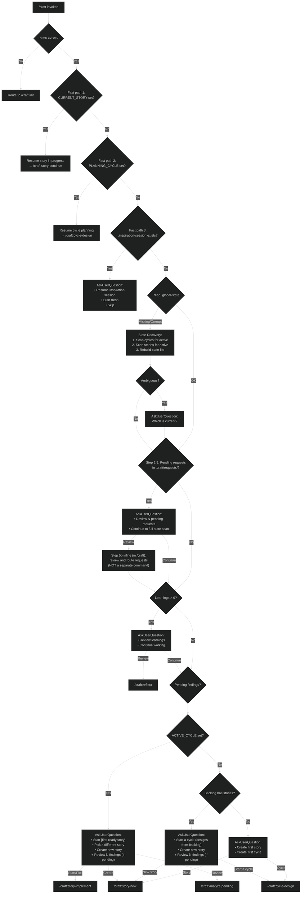

---

## Story Creation Flow: `/craft:story-new`

```mermaid
%%{init: {'theme': 'dark'}}%%
flowchart TD
    STORY_NEW["/craft:story-new"] --> CAPTURE["Step 1: Capture idea"]
    CAPTURE --> CLARIFY{"Idea clear?"}

    CLARIFY -->|No| ASK_CLARIFY["Clarify with user"]
    ASK_CLARIFY --> CLARIFY
    CLARIFY -->|Yes| SCAN{"Step 2.5: Story Source Detection<br/>concepts in .craft/planning/ OR<br/>non-abandoned .craft/mockups/ records?"}

    SCAN -->|"Both empty — zero behavior change"| CHOOSE_PATH
    SCAN -->|"Either has matches"| SOURCE{"AskUserQuestion:<br/>where does this story come from?<br/>(only options whose scan hit, plus Freeform)"}

    SOURCE -->|Freeform| CHOOSE_PATH
    SOURCE -->|"From mockup"| FROM_MOCKUP["Pre-fill from converged record<br/>mockup CSS is normative"]
    SOURCE -->|"From planning"| FROM_PLANNING["Read commands/references/story-from-planning.md<br/>execute phases 1-7 INLINE<br/>(NOT the Skill tool — chain break)"]

    FROM_PLANNING --> FP_WRITE["Concept select → Explore-agent extraction →<br/>gap-fill → write story with ## Reference Materials,<br/>source_concept, alignment: pending →<br/>forward-link active.md + consumed concepts"]
    FP_WRITE --> FP_END["FLOW ENDS at Phase 7<br/>do NOT continue to Step 3 or Step 3b"]

    CHOOSE_PATH{"Step 3: How formed is this idea?"}

    CHOOSE_PATH -->|"Just a spark"| SAVE_MIN["Step 10: Save & Place<br/>(minimal — no content-spark, no chunks)"]
    CHOOSE_PATH -->|"Let's get creative"| CONTENT_CREATIVE["Step 3b: Execute content-spark-inline.md<br/>(inline, NOT Skill tool — chain break)"]
    CHOOSE_PATH -->|"I know what I want"| CONTENT_SMART["Step 3b: Execute content-spark-inline.md<br/>(inline, NOT Skill tool — chain break)"]

    CONTENT_CREATIVE --> CREATIVE["PATH A: With Creative-Spark"]
    CONTENT_SMART --> SMART["PATH B: Skip Creative-Spark"]

    CREATIVE --> SPARK["Step 4: Execute creative-spark-inline.md<br/>(inline, NOT Skill tool - chain break)<br/>Generate 3-5 options + visual direction"]
    SPARK --> USER_PICK["Step 5: User picks option<br/>Visual direction comes from option<br/>(no separate design-vibe per-story)"]

    USER_PICK --> DESIGN_DECISIONS["Step 6: Capture typed design decisions<br/>AskUserQuestion: layout / component /<br/>density / visibility"]

    DESIGN_DECISIONS --> LOCK_CREATIVE["Decisions stored in story file<br/>(story-scoped, not project-locked)"]

    LOCK_CREATIVE --> CONT_OR_SAVE_A{"Continue or save?"}
    CONT_OR_SAVE_A -->|Save what we have| SAVE
    CONT_OR_SAVE_A -->|Keep designing| ALIGNMENT

    SMART["PATH B: Skip Creative-Spark"] --> QUICK["Step 7: Quick decisions only<br/>(story-scoped, NOT lock-decision unless project-wide)"]
    QUICK --> CONT_OR_SAVE_B{"Continue or save?"}
    CONT_OR_SAVE_B -->|Save what we have| SAVE
    CONT_OR_SAVE_B -->|Keep designing| ALIGNMENT
    CONT_OR_SAVE_B -->|"Let's get creative"| SPARK

    ALIGNMENT["Step 8: Codebase Alignment Check<br/>Spawn Explore agent, investigate codebase"]
    ALIGNMENT --> INVESTIGATE["Read commands/references/alignment-check.md<br/>Surface product questions"]
    INVESTIGATE --> GAPS{"Unasked product<br/>questions remain?"}
    GAPS -->|Yes| ASK_GAPS["AskUserQuestion:<br/>Conflicts, adjacencies, assumptions"]
    ASK_GAPS --> SCOPE_CHECK{"Answers expanded scope?"}
    SCOPE_CHECK -->|Yes| SENDMSG["SendMessage to same Explore agent<br/>Investigate new scope implications"]
    SENDMSG --> GAPS
    SCOPE_CHECK -->|No| GAPS
    GAPS -->|No| SET_ALIGNED["Set alignment: complete<br/>in story frontmatter"]

    SET_ALIGNED --> ACCEPTANCE["Step 9: Define acceptance,<br/>scope, preserve list, dependencies"]
    ACCEPTANCE --> SAVE

    SAVE["Step 10: Save & Place<br/>Write story file to .craft/backlog/<br/>Status: planning (until chunks planned)"]
    SAVE --> SAVE_MIN
    SAVE_MIN --> CHUNK_OFFER{"Step 11: Plan chunks now? (OPTIONAL)"}

    CHUNK_OFFER -->|"Yes, plan chunks now"| CHUNKS["Invoke plan-chunks via Skill tool<br/>(this IS a Skill invocation —<br/>plan-chunks does not chain back)<br/>Status → ready"]
    CHUNK_OFFER -->|"Later, just save spark"| KEEP_PLANNING["Status stays: planning<br/>plan-chunks needed before implementing"]
    CHUNK_OFFER -->|"Explore creatively first"| SPARK

    CHUNKS --> PLACE
    KEEP_PLANNING --> PLACE

    PLACE{"Step 12: Where should it go?"}
    PLACE -->|"Save to backlog"| DONE_BACKLOG["Stays in .craft/backlog/<br/>Ready for later (user decides when to implement)"]
    PLACE -->|"Add to current cycle"| MOVE["Run move-story.sh<br/>Move to cycle/stories/<br/>(does NOT auto-implement)"]
    PLACE -->|"Create new cycle"| ROUTE_CD["/craft:cycle-design"]
```

---

## Story Implementation Flow: `/craft:story-implement`

```mermaid
%%{init: {'theme': 'dark'}}%%
flowchart TD
    IMPL["/craft:story-implement"] --> CHECK_STATUS{"Status Guard"}

    CHECK_STATUS -->|backlog| BLOCK_BACKLOG["BLOCK: Assign to cycle first?<br/>→ /craft:cycle-assign"]
    CHECK_STATUS -->|complete| BLOCK_DONE["BLOCK: Story already complete.<br/>Pick another?"]
    CHECK_STATUS -->|blocked| BLOCK_DEP["BLOCK: Blocked by [X].<br/>Resolve first?"]
    CHECK_STATUS -->|ready/active| CHECK_CHUNKS{"Has chunks?"}

    CHECK_CHUNKS -->|No| ASK_PATH["AskUserQuestion:<br/>• Design it now (Creative)<br/>• Plan chunks directly<br/>• Pick different story"]
    CHECK_CHUNKS -->|Yes| CHECK_PARALLEL{"Parallel story active?"}

    CHECK_PARALLEL -->|Yes| CONFLICT_CHECK["Extract files from both stories"]
    CONFLICT_CHECK --> OVERLAP{"File overlap?"}
    OVERLAP -->|Yes| BLOCK_CONFLICT["AskUserQuestion:<br/>Files overlap: auth.ts, types.ts<br/>• Work on Story A first<br/>• Work on Story B first<br/>• Continue anyway (risk)"]
    OVERLAP -->|No| START_IMPL["Start implementation"]
    BLOCK_CONFLICT --> START_IMPL

    CHECK_PARALLEL -->|No| START_IMPL

    START_IMPL --> INIT_LEARNINGS["Learnings go to .craft/.learnings.yaml<br/>after each chunk (never held in memory)"]
    INIT_LEARNINGS --> REVIEW["Review story<br/>Show chunks, decisions, criteria"]

    REVIEW --> LOOP["IMPLEMENTATION LOOP"]

    LOOP --> CHECKPOINT["1. Git checkpoint<br/>Before chunk N"]
    CHECKPOINT --> DELEGATE["2. Spawn implementer agent<br/>Pass chunk details + context"]
    DELEGATE --> VALIDATE["3. Invoke chunk-validator agent via Task<br/>TypeScript, lint, tests"]

    VALIDATE --> LOG_ERRORS["Post-chunk learnings check:<br/>write any to .learnings.yaml now"]
    LOG_ERRORS --> PASS{"Validation passed?"}

    PASS -->|Yes| AUTO_NEXT["Auto-continue to next chunk"]
    PASS -->|No| REFINE["Invoke refine-chunk skill"]

    REFINE --> RETRY{"Attempt count?"}
    RETRY -->|"< 2"| VALIDATE
    RETRY -->|">= 2"| ESCALATE["Stop and ask user<br/>Offer rollback"]
    ESCALATE --> LOOP

    AUTO_NEXT --> MORE_CHUNKS{"More chunks?"}

    MORE_CHUNKS -->|Yes| RECHECK_PARALLEL["Re-check file conflicts"]
    RECHECK_PARALLEL --> LOOP
    MORE_CHUNKS -->|No| COMPLETE["STORY COMPLETION (Step 5)"]

    COMPLETE --> GATES["1. Story-final quality gates<br/>chunk-validator, MODE story-final"]
    GATES --> GATES_PASS{"Passed?"}
    GATES_PASS -->|No| FIX_LOOP["Validate-fix loop<br/>Must pass before the story can complete"]
    FIX_LOOP --> GATES
    GATES_PASS -->|Yes| AUDIT["1b. Claims audit (once per story)<br/>Write validation receipt<br/>claims-auditor checks bare claims against artifacts"]

    AUDIT --> AUDIT_RESULT{"Unsupported claims?"}
    AUDIT_RESULT -->|"None, or auditor failed to run"| CRITIQUE
    AUDIT_RESULT -->|"Some (interactive)"| AUDIT_ASK["AskUserQuestion:<br/>• Fix the issue<br/>• Correct the claim<br/>• Proceed, acknowledging the flag"]
    AUDIT_RESULT -->|"Some (autonomous)"| AUDIT_FLAG["Write ## Claims Audit into the story<br/>Flag and continue"]
    AUDIT_ASK --> CRITIQUE
    AUDIT_FLAG --> CRITIQUE

    CRITIQUE["2. Self-critique<br/>Compare to locked patterns,<br/>tokens, acceptance criteria"]
    CRITIQUE --> USAGE["3. Usage summary<br/>4. Present results"]
    USAGE --> LEARN["5. Verify learnings written<br/>6. Story reflection<br/>(tally, append to .learnings.yaml)"]
    LEARN --> SPARK["7. Spark verification<br/>Re-read The Pitch, confirm conditions cashed<br/>Gap found: stop and plan another chunk"]
    SPARK --> MANIFEST["7b. Write .commit-manifest<br/>complete-story.sh stages only what it lists"]
    MANIFEST --> MARK_DONE["8. Run complete-story.sh<br/>Mark story complete, commit the manifest"]
    MARK_DONE --> LEFTOVER["8b. Leftover triage<br/>Ledger lookup first, never re-ask<br/>Interactive: Ignore / Claim / Leave per file<br/>Autonomous: leave and report"]

    LEFTOVER --> CYCLE_DONE{"9. All stories done?"}
    CYCLE_DONE -->|Yes| ROUTE_COMPLETE["/craft:cycle-complete"]
    CYCLE_DONE -->|No| NEXT_READY{"Ready story left?"}
    NEXT_READY -->|Yes| NEXT_STORY["Chain carries straight on<br/>to the next story"]
    NEXT_READY -->|"No, stories still in planning"| PLAN_NEXT["craft:plan-chunks for the next planning story"]
    PLAN_NEXT -->|"Planning done: re-check"| NEXT_READY
    NEXT_READY -->|"Chain pauses back to the user"| OBS_9A["9a. Surface unread observations<br/>(skipped when autonomous)"]
```

---

## Cycle Creation Flow: `/craft:cycle-design`

```mermaid
%%{init: {'theme': 'dark'}}%%
flowchart TD
    CYCLE_DESIGN["/craft:cycle-design"] --> MODE_DISPATCH{"Mode dispatch<br/>(args provided?)"}

    MODE_DISPATCH -->|"Args = existing PLANNING cycle"| DETAILING["Read references/cycle-design/<br/>detailing-mode.md<br/>(Resume + flesh out unfinished cycle)"]
    MODE_DISPATCH -->|"Args = ready/active/complete cycle"| ERR["Error: cycle not in planning.<br/>Use /craft:cycle-start instead"]
    MODE_DISPATCH -->|"No args (new cycle)"| NAME["Step 1: Name & Goal"]

    NAME --> PLAN_SCAN["Scan conversation for planning doc refs<br/>verify each exists in .craft/planning/<br/>prepare source_concept, or empty"]
    PLAN_SCAN --> GATE{"Safety gate — MANDATORY, runs every path,<br/>cannot be skipped<br/>AskUserQuestion: confirm name + goal +<br/>source_concept BEFORE any file write"}
    GATE -->|"Change source"| GATE
    GATE -->|"Change name or goal"| GATE
    GATE -->|"Actually this is freeform"| GATE
    GATE -->|"Confirm and proceed"| CREATE_FILES

    CREATE_FILES["Create cycle.yaml + .state IMMEDIATELY<br/>(create-cycle.sh, 5th arg = source-concept-paths)<br/>Set PLANNING_CYCLE in .global-state<br/>(prevents orphaned dirs on interrupt)"]
    CREATE_FILES --> DEPTH{"Step 1b: Planning depth?"}

    DEPTH -->|"Add stories now"| DEFAULT["Read references/cycle-design/<br/>default-mode.md"]
    DEPTH -->|"Quick sketch (Roadmap)"| ROADMAP["Read references/cycle-design/<br/>roadmap-mode.md<br/>(story titles only, detail later)"]

    DEFAULT --> BRAINSTORM["Step 2: Brainstorm story list<br/>(plain conversation —<br/>NO skill invocation here:<br/>brainstorm is decomposition,<br/>not creative exploration)"]
    BRAINSTORM --> LIST["Present story list"]
    LIST --> CONFIRM_LIST{"User confirms?"}
    CONFIRM_LIST -->|No| ADJUST["Add/remove/adjust"]
    ADJUST --> LIST
    CONFIRM_LIST -->|Yes| FOR_EACH["FOR EACH STORY (Step 3)"]

    FOR_EACH --> MOMENT{"Step 2.7 Planning-Source Routing<br/>cycle.yaml source_concept populated?"}
    MOMENT -->|"Empty — freeform cycle"| STORY_SPARK
    MOMENT -->|"Add-a-separate-story moment"| STORY_SPARK
    MOMENT -->|"Planning-extraction moment"| EXTRACT_STORY["Read commands/references/story-from-planning.md<br/>execute inline with the INVOCATION marker<br/>(Phase 1 auto-resolves from cycle.yaml)"]
    EXTRACT_STORY --> SAVE_STORY

    STORY_SPARK["3a: Discuss spark"]
    STORY_SPARK --> STORY_CONTENT["3b: content-spark per story<br/>(inline-via-reference)"]
    STORY_CONTENT --> STORY_PATH{"With creative-spark or skip?"}
    STORY_PATH -->|With creative-spark| STORY_CREATIVE["creative-spark per story<br/>(inline-via-reference)<br/>visual direction included"]
    STORY_PATH -->|Skip| STORY_DECIDE["Quick technical decisions"]
    STORY_CREATIVE --> STORY_LOCK
    STORY_DECIDE --> STORY_LOCK["lock-decision (typed keys)"]
    STORY_LOCK --> STORY_ALIGN["3c: Codebase Alignment Check<br/>(commands/references/alignment-check.md)"]
    STORY_ALIGN --> STORY_GAPS{"Unasked product<br/>questions remain?"}
    STORY_GAPS -->|Yes| STORY_ASK["AskUserQuestion +<br/>SendMessage loop"]
    STORY_ASK --> STORY_GAPS
    STORY_GAPS -->|No| STORY_ALIGNED["Set alignment: complete"]
    STORY_ALIGNED --> STORY_ACCEPT["3d: Define acceptance"]
    STORY_ACCEPT --> SAVE_STORY["Write story file immediately<br/>.craft/cycles/[name]/stories/<br/>status: planning"]
    SAVE_STORY --> MORE_STORIES{"More stories?"}
    MORE_STORIES -->|Yes| FOR_EACH
    MORE_STORIES -->|No| VIBE["Step 7: design-vibe<br/>(CYCLE-LEVEL cohesion check<br/>across all UI stories — once per cycle)"]
    VIBE --> CHUNKS_BATCH["Invoke plan-chunks MODE=batch<br/>(parallel planning across stories)"]
    CHUNKS_BATCH --> REVIEW["Cycle review"]

    REVIEW --> CERTAINTY{"Right stories in right order?"}
    CERTAINTY -->|No| REVISIT["Edit/add/remove/reorder"]
    REVISIT --> REVIEW
    CERTAINTY -->|Yes| ACTIVATE{"Activate now?"}

    ACTIVATE -->|Yes| SET_ACTIVE["Clear PLANNING_CYCLE<br/>Route to /craft:cycle-start"]
    ACTIVATE -->|No| KEEP_READY["Clear PLANNING_CYCLE<br/>Cycle stays in ready state"]

    ROADMAP --> ROADMAP_DONE["Story titles sketched.<br/>Detail later via<br/>/craft:cycle-design [name]<br/>(re-enters via Detailing Mode)"]
```

**Planning-source routing (Step 2.7)** applies in all three modes (default, roadmap, detailing). For each story, the moment is determined independently: a *planning-extraction* story is drawn from the cycle's `source_concept` via `story-from-planning.md` (Read inline, with the `INVOCATION` marker so Phase 1 auto-resolves), while an *add-a-separate-story* story is freeform and gets no `source_concept`. Mixed cycles work natively. Existing stories are never retroactively stamped — populating `source_concept` on an existing story is a user-initiated recovery affordance, never silent.

---

## Cycle Start Flow: `/craft:cycle-start`

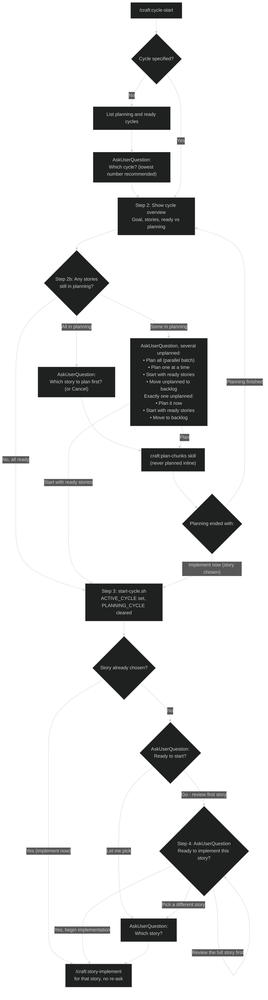

---

## Cycle Complete Flow: `/craft:cycle-complete`

```mermaid
%%{init: {'theme': 'dark'}}%%
flowchart TD
    CYCLE_COMPLETE["/craft:cycle-complete"] --> CHECK_STORIES{"Step 1: All stories complete?"}

    CHECK_STORIES -->|No| ASK_END["AskUserQuestion:<br/>• Complete cycle (archive incomplete)<br/>• Continue working"]
    ASK_END -->|Continue| EXIT["Exit"]
    ASK_END -->|Complete| COUNT

    CHECK_STORIES -->|Yes| COUNT["Step 2: Count pending learnings<br/>and ungraduated fixes (FIX_COUNT)"]

    COUNT --> THRESHOLD{"Pending learnings > 0 OR<br/>FIX_COUNT >= rule_pass_threshold<br/>(default 10)?"}
    THRESHOLD -->|Yes| ASK_REFLECT["AskUserQuestion:<br/>Reflect before archiving?"]
    THRESHOLD -->|No| WALK_CHECK
    ASK_REFLECT -->|"Yes, reflect now"| REFLECT["/craft:reflect<br/>(learnings and rule pass live there;<br/>nothing is applied in cycle-complete)"]
    ASK_REFLECT -->|"Skip reflection"| KEEP["Learnings stay pending<br/>Fix watermark untouched"]
    REFLECT --> WALK_CHECK
    KEEP --> WALK_CHECK

    WALK_CHECK{"Step 2b: Any type: ui stories?"}
    WALK_CHECK -->|Yes| WALKTHROUGH["Assemble brief, run walkthrough-analyzer<br/>File findings as bug records<br/>(analysis-bug-filing.md)<br/>Never pauses, remember the count"]
    WALK_CHECK -->|No| INCOMPLETE
    WALKTHROUGH --> INCOMPLETE["Step 3: Move incomplete stories<br/>(ready or active) back to backlog"]

    INCOMPLETE --> OBS_MODE{"Step 3c: Autonomous run?"}
    OBS_MODE -->|Yes| ARCHIVE
    OBS_MODE -->|No| OBS_COUNT{"Unread observations?"}
    OBS_COUNT -->|Yes| OBS_SURFACE["Surface observations<br/>(cluster, digest, route, mark surfaced)"]
    OBS_COUNT -->|No| ARCHIVE
    OBS_SURFACE --> ARCHIVE

    ARCHIVE["Step 4: Run complete-cycle.sh<br/>Cycle status complete<br/>Clear ACTIVE_CYCLE and CURRENT_STORY"]

    ARCHIVE --> SUMMARY["Step 5: Cycle Complete Summary<br/>Stories, Duration,<br/>Bugs filed (only when any)"]

    SUMMARY --> NEXT["AskUserQuestion:<br/>• Start new cycle<br/>• Review backlog<br/>• Take a break"]
```

---

## Reflect Flow: `/craft:reflect`

Reflect does the work itself. Cycle-complete only offers it.

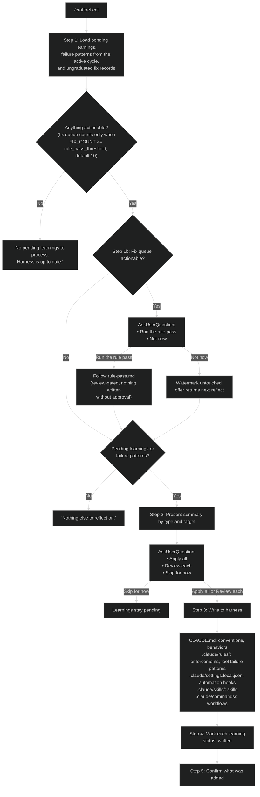

---

## Analysis Flow: `/craft:analyze`

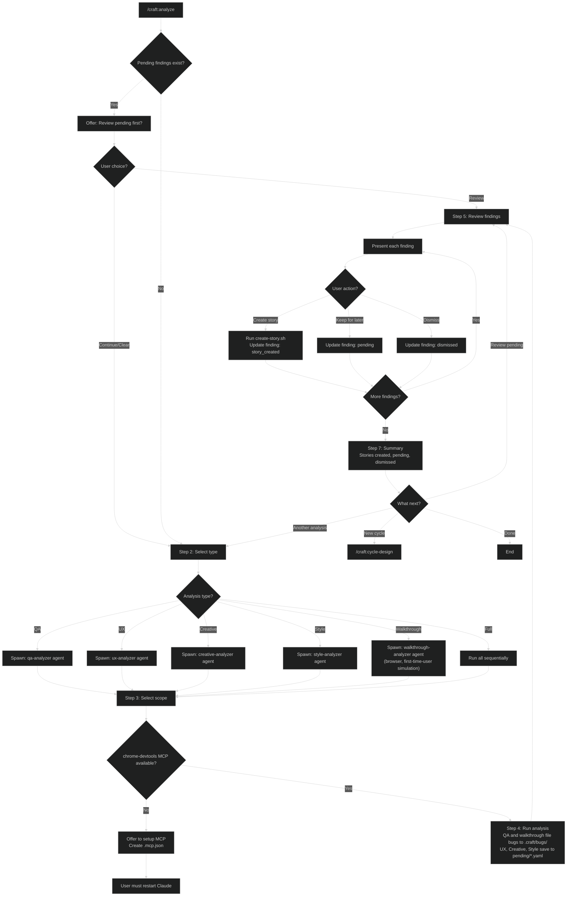

---

## Mockup Flow: `/craft:mockup`

Reached two ways: the user invokes `/craft:mockup` directly, or `/craft:init`'s First Cycle Kickoff routes here - init ends in a deterministic first-move question (Mock up a screen / Describe a feature / I'll take it from here) where the mockup option appears only for ui/hybrid projects and carries (Recommended) when the project was empty at scan time (`total_files == 0` in `.craft/design/.confidence-signals.yaml`).

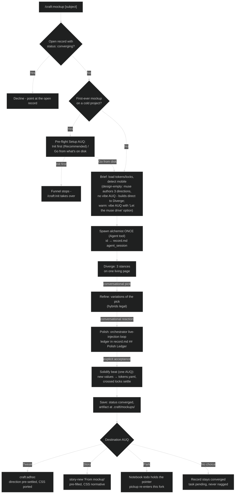

---

## Dial Flow: `/craft:dial`

Settles a visual question on a surface that already renders: 2-4 lettered candidates are injected into the running app (nothing written to source; a refresh discards everything), the user clicks through them against real data and reacts in chat, and the session files a `.craft/dials/` record whichever way it ends - including "current was right." The flow lives in `commands/references/dial-inline.md` with injection payloads in `commands/references/dial-inject.md`; no AskUserQuestion appears anywhere in it.

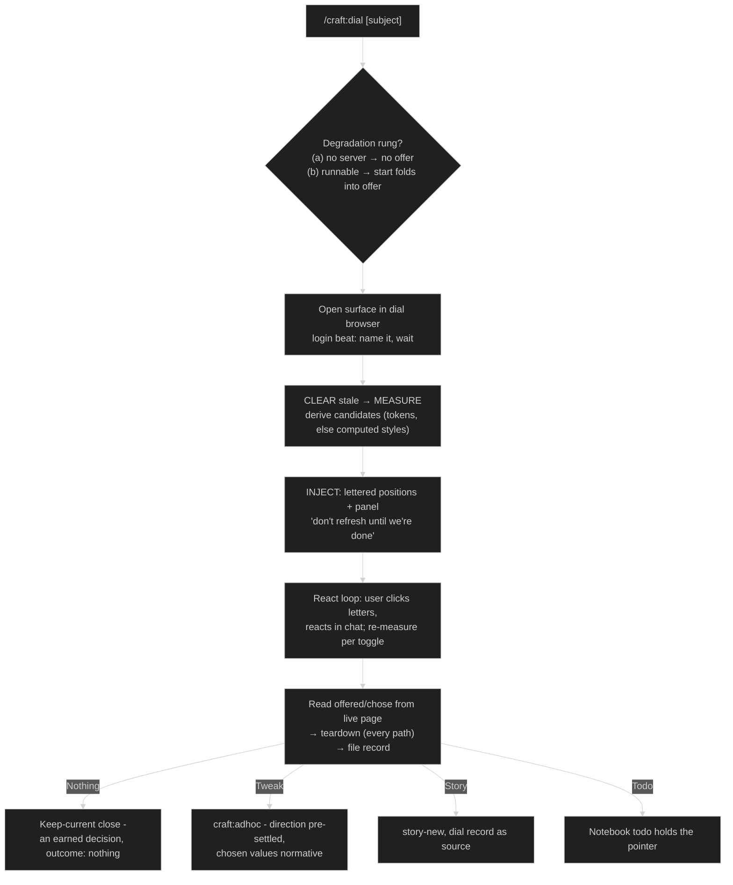

---

## Planning Flow: `/craft:planning`

The strategic roadmap layer above cycles and stories. Manages initiatives, concepts, and open questions, and matures concepts into cycle stories. The main flow below routes on whether a planning folder already exists; the Alignment Walkthrough (further down) is a reusable sub-procedure called from two points.

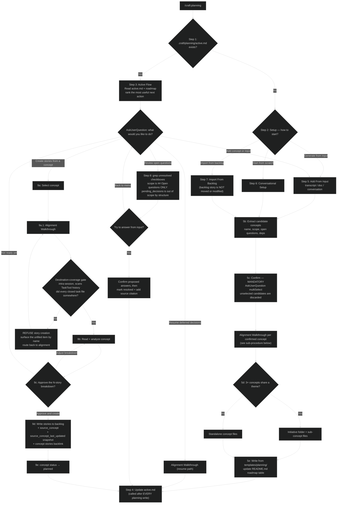

**Notes on the main flow:**

- **Step 11 — Auto-promotion.** Adding a sub-concept to a concept that exists as a single `.md` file promotes it to a folder: the original content becomes the folder's `README.md` (reformatted as an initiative README), the new sub-concept lands beside it, and `README.md`'s roadmap reference updates.
- **Path-discovery rule.** Only `active.md` and `README.md` are hardcoded paths (fixed convention, never promote). Every other planning path is discovered via Glob.
- **TaskTool is a hard dependency.** The Alignment Walkthrough's working queue lives in TaskTool. If a future harness mode restricts `TaskCreate`, the walkthrough must **fail loudly**, not silently fall back to bundled AskUserQuestion.

Concept completion is a separate entry point — it is called from the story/cycle completion flow, never by the user directly:

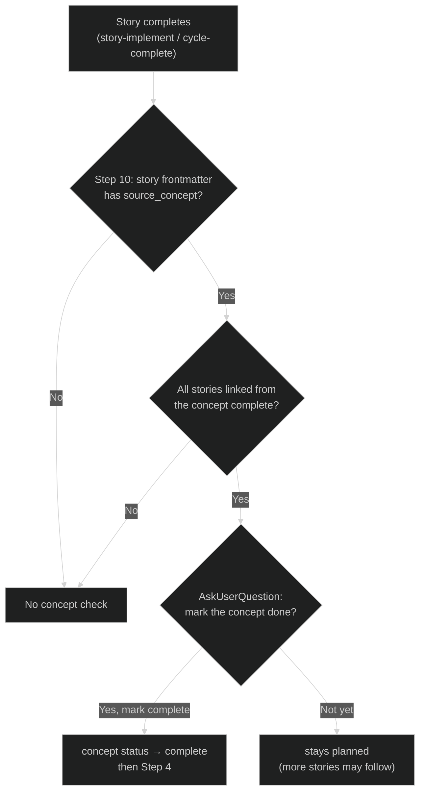

### Alignment Walkthrough (sub-procedure)

Invoked from Step 5c (after candidate concepts are confirmed) and Step 9a.1 (before story breakdown). Resolves a concept's strategic sub-decisions one at a time. Conversation is the primary resolution surface; `AskUserQuestion` is the **parking** mechanism, not the asking mechanism — firing it for a question the user can answer right now is a bug.

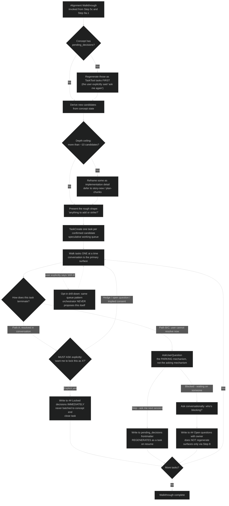

**The three-destination invariant.** Every strategic sub-decision terminates in exactly one of: `## Locked decisions` (Path A, explicit lock only), `pending_decisions[]` frontmatter (Path B, regenerates on resume), or `## Open questions` with an owner annotation (Path C, does not regenerate). The concept file is canonical state and survives sessions because resolutions hit disk the moment they resolve; TaskTool is session-scoped working memory and is allowed to die.

---

## Complete State Machine

```mermaid
%%{init: {'theme': 'dark'}}%%
stateDiagram-v2
    [*] --> NO_CRAFT: No .craft folder

    NO_CRAFT --> INITIALIZED: /craft:init

    INITIALIZED --> HAS_BACKLOG: /craft:story-new
    INITIALIZED --> PLANNING_CYCLE: /craft:cycle-design

    HAS_BACKLOG --> PLANNING_CYCLE: /craft:cycle-design
    HAS_BACKLOG --> HAS_BACKLOG: /craft:story-new (more stories)

    PLANNING_CYCLE --> CYCLE_READY: 95% alignment + create files

    CYCLE_READY --> CYCLE_ACTIVE: /craft:cycle-start

    CYCLE_ACTIVE --> STORY_ACTIVE: Pick story to implement
    CYCLE_ACTIVE --> CYCLE_ACTIVE: /craft:reflect (convert learnings to harness updates)

    STORY_ACTIVE --> STORY_ACTIVE: Chunk loop (learnings accumulate)
    STORY_ACTIVE --> STORY_COMPLETE: All chunks done

    STORY_COMPLETE --> CYCLE_ACTIVE: More stories
    STORY_COMPLETE --> CYCLE_COMPLETE: All stories done → /craft:cycle-complete

    CYCLE_COMPLETE --> HARNESS_UPDATED: Optional /craft:reflect converts learnings → CLAUDE.md, rules, hooks, skills, commands
    HARNESS_UPDATED --> ANALYZING: /craft:analyze
    HARNESS_UPDATED --> HAS_BACKLOG: Create stories from analysis
    HARNESS_UPDATED --> PLANNING_CYCLE: /craft:cycle-design

    ANALYZING --> HAS_BACKLOG: Create stories from findings
    ANALYZING --> HARNESS_UPDATED: Done analyzing

    note right of NO_CRAFT: .craft/ doesn't exist
    note right of INITIALIZED: .craft/ exists, empty
    note right of HAS_BACKLOG: Stories in .craft/backlog/
    note right of PLANNING_CYCLE: PLANNING_CYCLE set in .global-state
    note right of CYCLE_READY: Cycle files created, not active
    note right of CYCLE_ACTIVE: ACTIVE_CYCLE set, .learnings.yaml tracking
    note right of STORY_ACTIVE: CURRENT_STORY set, learnings written to .learnings.yaml after each chunk
    note right of CYCLE_COMPLETE: All stories done, reflect offered when due, bugs filed if a UI walkthrough finds any
    note right of HARNESS_UPDATED: Written by /craft:reflect (CLAUDE.md, rules, hooks, skills, commands), not cycle-complete
```

---

## Learnings Flow

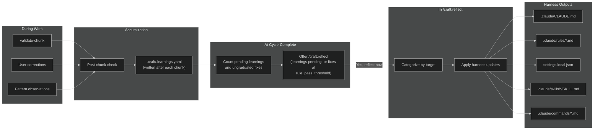

---

## Commands Reference

| Command | Purpose |
|---------|---------|
| `/craft` | Main entry point — routes based on context |
| `/craft:init` | One-time setup for new projects |
| `/craft:status` | Rich dashboard (cycles, stories, backlog) |
| `/craft:dashboard` | Open the project graph page - cycles, stories, records, and how they connect |
| `/craft:story-new` | Create story → backlog (with alignment check) |
| `/craft:story-implement` | Implement story with chunk loop |
| `/craft:story-implement-auto` | Implement a story (autonomous, for implement phase) |
| `/craft:story-continue` | Resume interrupted story |
| `/craft:story-archive` | Move story back to backlog |
| `/craft:story-delete` | Delete a story |
| `/craft:cycle-design` | Create cycle with planned stories (95% alignment) |
| `/craft:cycle-start` | Activate cycle and start implementation |
| `/craft:cycle-assign` | Move story from backlog to cycle |
| `/craft:cycle-complete` | Offer reflection, walk through UI work and file bugs, archive the cycle |
| `/craft:reflect` | Convert captured learnings into harness updates anytime |
| `/craft:analyze` | Post-cycle QA, UX, Creative, Style, Walkthrough analysis |
| `/craft:review` | PR-style code review — branch, story, or project audit. `--maze` flag for perpendicular review |
| `/craft:update-docs` | Re-scan project, update project.md and locked.md |
| `/craft:docs` | Generate or update docs using the crystallized doc-writer agent |
| `/craft:become` | Crystallize a tool, role, or person into a portable 9-section agent |
| `/craft:ask` | Consult a workshop agent — routes to the best available mind |
| `/craft:guide` | Read-only help agent for using craft itself - explains and diagnoses, never changes anything |
| `/craft:workflow` | Workflow router — dashboard, status, and dispatch to workflow-run or workflow-design |
| `/craft:workflow-run` | Run a workflow session — start, continue, next, run-all, batch-create, mark ready |
| `/craft:workflow-design` | Author workflow definitions — create new, edit existing, archive unused |
| `/craft:research` | Ad-hoc research — discover, elaborate, synthesize with ranked branches |
| `/craft:research-verify` | Verify existing research findings against independent primary sources |
| `/craft:adhoc` | Adhoc fix or tweak without story ceremony. Bugs record to `.craft/fixes/`, tweaks to `.craft/tweaks/` |
| `/craft:notebook` | Low-ceremony capture for ideas, todos, and notes (durable project facts) before they harden into stories |
| `/craft:decisions` | The Shelf - what waits on you, what's ruled, what's claimed, what became real. Rule on a card, or graduate a selection into a cycle |
| `/craft:bugs` | File a bug without fixing it, from a person or an agent, and close it with a verdict. Opens with the live open pile |
| `/craft:mockup` | Live HTML mockup funnel - 3 options, converge by reacting, graduate to tweak/story/todo |
| `/craft:dial` | Live value calibration - 2-4 lettered candidates injected into the running app, chosen by eye against real data |
| `/craft:riff` | Two-player thinking game in the main loop - pass an idea in small beats until it's ready to build; bare invocation opens from the oldest open notebook idea |
| `/craft:planning` | Feature roadmap and planning - initiatives, concepts, open questions |
| `/craft:project` | Switch projects or cross-project dashboard |
| `/craft:browser` | Interactive browser session via playwright-cli (a skill invoked as a command) |

<!-- skill-commands: adhoc, browser -->
<!-- Commands Reference contract: this table lists every command file (commands/craft.md as /craft, plus commands/craft-*.md as /craft:<name>) PLUS skills invoked as /craft: commands (the skill-commands marker above: adhoc, browser). The doc-integrity check (Story 26) parses the marker to treat those two as skill-backed entry points, not command files. -->

## Skills Reference

| Skill | Invoked During | Purpose |
|-------|----------------|---------|
| `content-spark` | story-new, cycle-design | Surface content assumptions before creative/planning |
| `creative-spark` | story-new, cycle-design | Generate options, brainstorm. Step 1.5 invokes muse/alchemist interrogators |
| `design-vibe` | story-new, cycle-design (if UI) | Visual direction, aesthetics |
| `lock-decision` | story-new, cycle-design | Formalize approved decisions (typed keys) |
| `plan-chunks` | story-new, cycle-design | Break story into implementable pieces. Batch mode requires Dependencies section |
| `validate-chunk` | story-implement | TypeScript, lint, tests. Derives FILES_CHANGED from git diff |
| `refine-chunk` | story-implement | Fix validation failures |
| `test-fix` | story-implement | Triage failing tests, fix the right thing |
| `adhoc` | /craft:adhoc | Adhoc fix or tweak without story ceremony |
| `approve` | any (write gate) | Request scoped write permission from the user |
| `browser` | /craft:browser | Launch persistent playwright-cli browser session |

## Agents Reference

See `docs/agent-catalog.md` for full descriptions, model assignments, and usage guidance.

**Core Workflow**

| Agent | Invoked During | Purpose |
|-------|----------------|---------|
| `implementer` | story-implement | Owns implement→validate→refine loop per chunk |
| `tester` | story-implement | Integration tests, E2E, final validation |
| `chunk-validator` | validate-chunk | Runs quality checks, returns structured report (haiku) |
| `claims-auditor` | story-implement (story-final) | Verifies completion claims against on-disk artifacts (haiku) |
| `plan-chunks-agent` | plan-chunks (batch) | Autonomous chunk planning per story |
| `project-scanner` | update-docs | Full project analysis for documentation updates |

**Analysis**

| Agent | Invoked During | Purpose |
|-------|----------------|---------|
| `qa-analyzer` | analyze (QA) | Find bugs, errors, edge cases |
| `ux-analyzer` | analyze (UX) | Find friction, accessibility issues |
| `creative-analyzer` | analyze (Creative) | Find delight opportunities |
| `style-analyzer` | analyze (Style) | Find token violations, pattern drift |
| `walkthrough-analyzer` | analyze (Walkthrough) | First-time user simulation, clicks everything |

**Review and Research**

| Agent | Invoked During | Purpose |
|-------|----------------|---------|
| `pr-reviewer-expert` | /craft:review | PR review crystallized from CodeRabbit |
| `maze-architect` | /craft:review --maze | Perpendicular review questions from diff (haiku) |
| `researcher` | /craft:research | Investigates one sub-question, writes branch file |
| `research-synthesizer` | /craft:research | Reads all branch files, writes _plan.md + _sources.md |
| `verifier` | /craft:research-verify | Adversarial claim checker |
| `practitioner-reviewer` | /craft:research-verify | Challenges verified claims from experience |

**Browser**

| Agent | Invoked During | Purpose |
|-------|----------------|---------|
| `playwright-browser` | browser skill | Owns a live browser session via playwright-cli |

**Crystallized Experts** (consult via `/craft:ask`)

| Agent | Purpose |
|-------|---------|
| `muse` | Emotional job translator - interrogator for creative-spark Step 1.5; on the mockup funnel's muse path, authors 3 directions that build directly (no vibe widget) |
| `riff` | Creative collaboration partner - a thinking companion, not an instructor |
| `alchemist` | CSS interaction physicist — interrogator for creative-spark Step 1.5 |
| `conductor` | AI orchestration architect |
| `doc-writer` | Documentation diagnostician |
| `product-anthropologist` | Human-truth layer — diagnoses real-problem fit |
| `crystallizer` | Psychological synthesizer, distills research into agent personas (opus) |
| `become-researcher` | Psychological material collector for `/craft:become` |

**Guide**

| Agent | Purpose |
|-------|---------|
| `guide` | Read-only craft help agent - explains how craft works, diagnoses your `.craft/` state; auto-triggers or via `/craft:guide` |

## State Files Reference

| File | Purpose | Key Fields |
|------|---------|------------|
| `.craft/.global-state` | Global state | ACTIVE_CYCLE, PLANNING_CYCLE, CURRENT_STORY, RUN_MODE, CRAFT_WRITE_ENABLED |
| `.craft/.continuation` | Breadcrumb for a nested skill invocation (30-min TTL, one-shot) | caller path |
| `.craft/.active-fix` | Safety marker for in-progress adhoc work (session-start clears orphans) | timestamp |
| `.craft/settings.yaml` | User preferences | rule_pass_threshold, taste_pass_enabled, taste_pass_threshold, map (enabled, token_budget), dev_mode (true lets writes past the write gate) |
| `.craft/requests/*.md` | Pending requests surfaced at the `/craft` entry (Step 2.5) | request files |
| `.craft/cycles/[N]-[name]/.state` | Cycle runtime state | CURRENT_STORY, CURRENT_CHUNK, TOTAL_CHUNKS |
| `.craft/cycles/[N]-[name]/.learnings.yaml` | Accumulated learnings | errors, corrections, patterns, conventions, automations |
| `.craft/cycles/[N]-[name]/cycle.yaml` | Cycle metadata | status, goals, target, focus (no stories array) |
| `.craft/cycles/[N]-[name]/stories/[N]-[name].md` | Story details | status, chunks, decisions (typed), acceptance |
| `.craft/backlog/[name].md` | Backlog stories | status: ready, priority |
| `.craft/analysis/pending/*.yaml` | Pending findings | UX, Creative, and Style queues (QA and walkthrough file bugs to `.craft/bugs/`) |
| `.craft/fixes/[name].md` | Adhoc fix records | Created by /craft:adhoc (bug path) |
| `.craft/tweaks/tweak-[slug].md` | Tweak records, open until the user accepts | Created by /craft:adhoc (tweak path) |
| `.craft/workflows/` | Workflow session state | per-session state dirs |
| `.craft/notebook/` | Low-ceremony captured ideas and todos | idea / todo entries |
| `.craft/bugs/` | Bug records from /craft:bugs, the QA analyzer, and the walkthrough. Closed ones move to `closed/` | status, verdict, hits |
| `.craft/dials/` | Dial session records from /craft:dial (born closed) | record per session |
| `.craft/decisions/` | Decision records from /craft:decisions: pending at the top, `approved/` for ruled, `archive/` for declined or retired | status, created, source, tags (the Shelf groups by tag) |
| `.craft/research/` | Research and become branch files | `{slug}/_plan.md`, `NN-branch.md` |
| `.craft/mockups/[date]-[slug]/record.md` | Mockup records - status is the ledger, open until graduated/abandoned | status, agent_session, muse_session, solidify_outcome, graduated_to |

## Directory Structure Check Points

```
.craft/                          ← EXISTS? → If no, route to /craft:init
├── .global-state                ← READ for ACTIVE_CYCLE, PLANNING_CYCLE, CURRENT_STORY
├── settings.yaml                ← READ for rule_pass_threshold, taste_pass_*, map, dev_mode
├── backlog/                     ← COUNT stories here
│   └── *.md                     ← Each is a ready story
├── cycles/                      ← LIST available cycles
│   └── [N]-[name]/
│       ├── cycle.yaml           ← READ status (ready/active/complete)
│       ├── .state               ← READ CURRENT_STORY, CURRENT_CHUNK (runtime only)
│       ├── .learnings.yaml      ← READ/WRITE during cycle for learnings
│       └── stories/
│           └── *.md             ← READ status, chunks
├── fixes/                       ← Adhoc fix records (permanent log)
├── tweaks/                      ← Tweak records (permanent log, open until user accepts)
├── requests/                    ← Pending requests checked at /craft entry (Step 2.5)
├── notebook/                    ← Low-ceremony idea/todo capture
├── bugs/                        ← Bug records (closed/ holds fixed and won't-fix)
├── dials/                       ← Dial session records
├── decisions/                   ← Decision records (approved/, archive/)
├── research/                    ← Research + become branch files
├── mockups/                     ← Mockup artifacts: [date]-[slug]/ (mockup.html, record.md, rounds/)
├── workflows/                   ← Workflow session state
├── analysis/
│   └── pending/
│       ├── ux.yaml              ← CHECK for pending findings
│       ├── creative.yaml
│       └── style.yaml
└── design/
    └── locked.md                ← READ locked patterns for validation
```

---

## Resolved Design Decisions

| Decision | Resolution |
|----------|------------|
| Status transitions | **Gate at command level** — status guards in story-implement and cycle-assign |
| Backlog vs cycle handling | **Smart inference with AskUserQuestion** — contextual options based on state |
| Pending findings check | **Include as AskUserQuestion option** — shown when pending > 0 |
| State corruption recovery | **Hybrid reconstruct + ask** — scan files, rebuild, ask if ambiguous |
| Parallel stories | **Bulletproof file conflict detection** — extract files from chunks, block overlaps |
| Reflect vs cycle-complete | **Reflect owns learnings and harness updates, cycle-complete only offers it** - separation of concerns |
| Learnings ownership | **validate-chunk logs errors, AskUserQuestion for corrections** |
| 95% alignment check | **Codebase investigation loop before plan-chunks.** Orchestrator spawns Explore agent, surfaces product questions (conflicts, adjacencies, assumptions), loops via SendMessage until zero unasked questions remain. Gate measures user intent capture, not solution confidence. `alignment` frontmatter field (`pending`/`complete`) ensures no story skips the check. See `commands/references/alignment-check.md`. |
| Design decisions | **Typed keys (layout/component/density/visibility)** — structured for Tokens Studio |
| Harness freshness | **Superseded** - cycle-complete no longer checks for Claude Code updates or applies harness changes |
| Harness updates | **Applied by reflect** - cycle-complete counts learnings and fixes, offers /craft:reflect, and applies nothing itself |
| Context safety | **Save stories immediately when confirmed** — survives context compaction mid-planning |
